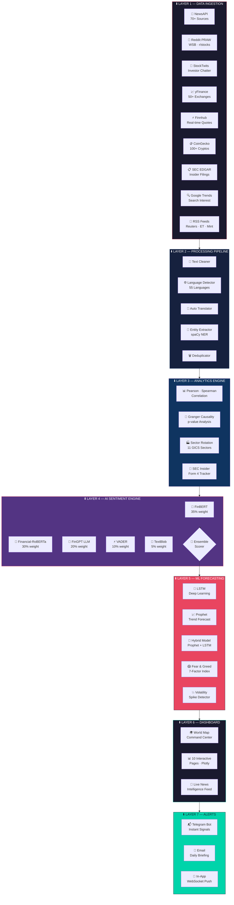
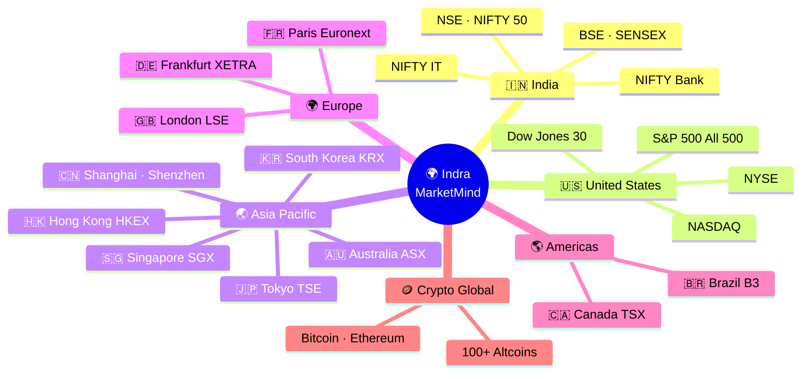
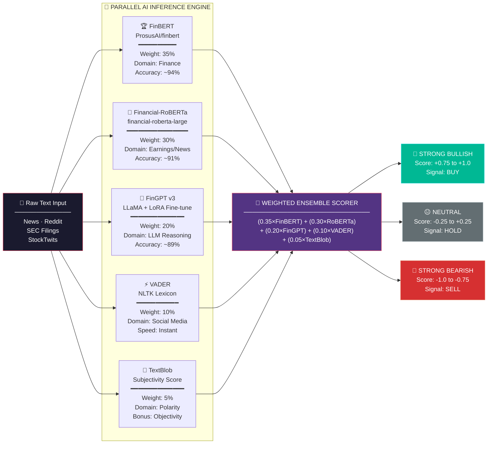
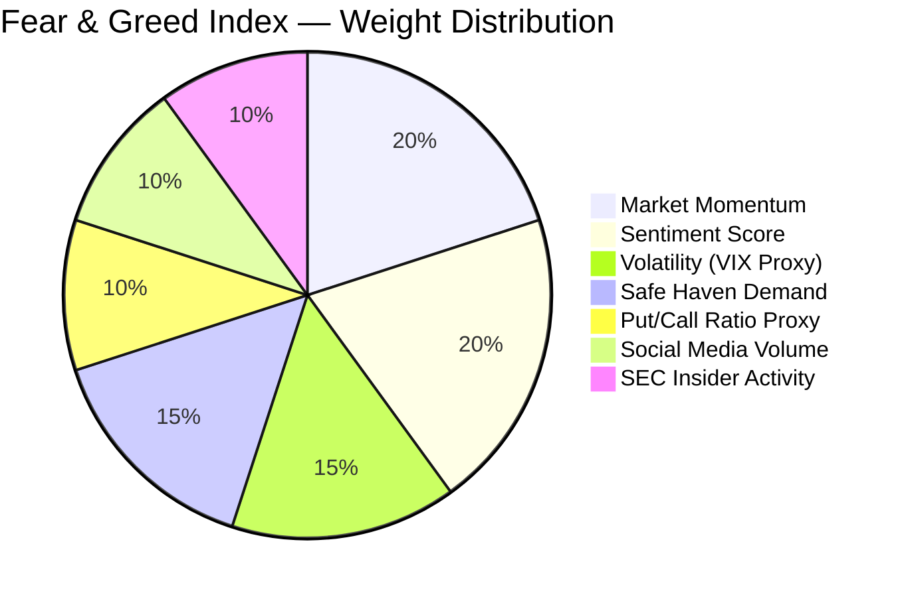
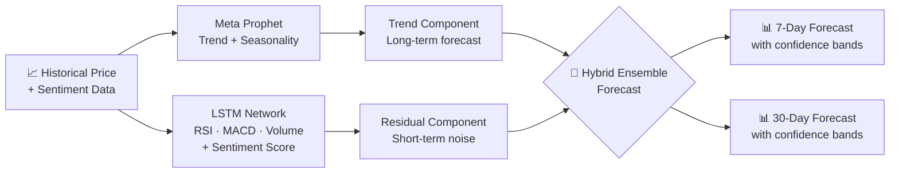
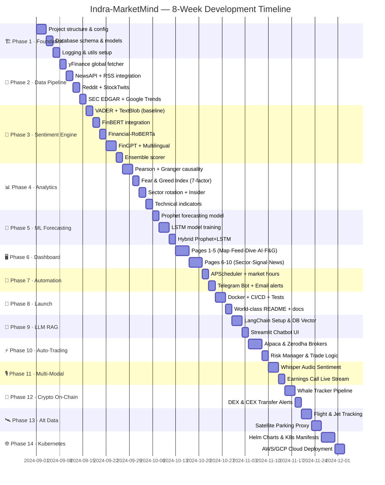
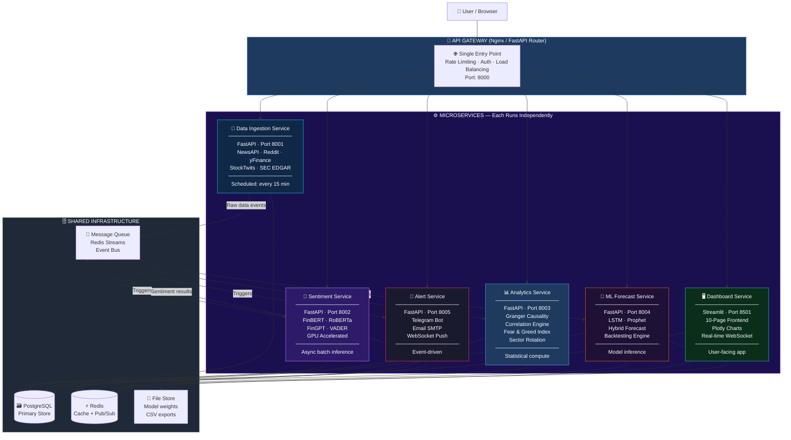
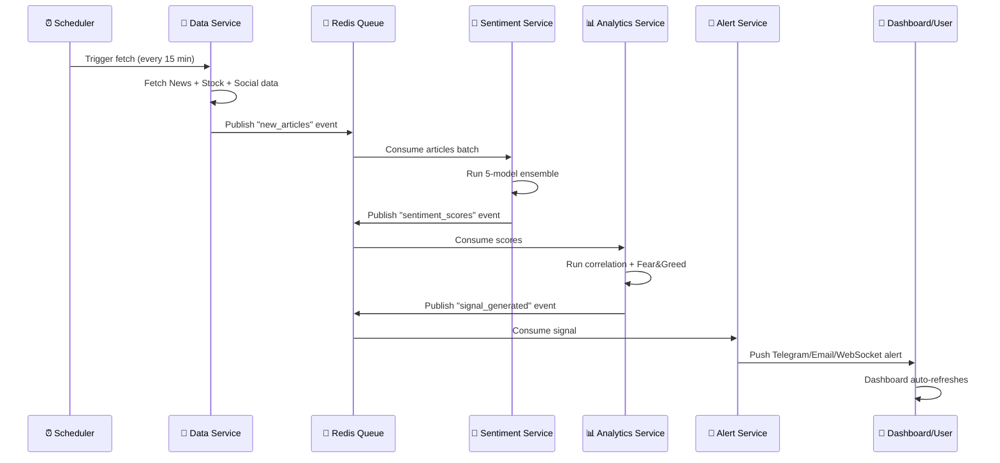
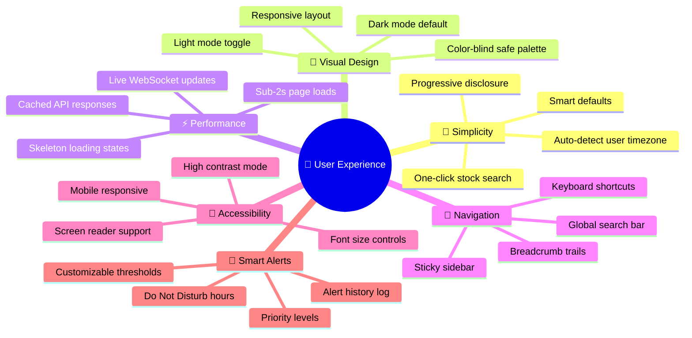

<div align="center">

<!-- ═══════════════════════════════════════════════════════════ -->
<!--                    HERO SECTION                           -->
<!-- ═══════════════════════════════════════════════════════════ -->

<!-- ══ COLORFUL ANIMATED SVG BANNER ══ -->


<br/>


<br/><br/>

[](https://python.org)
[](https://huggingface.co)
[](#)
[](#)
[](LICENSE)
[](#)

<br/>

[](https://huggingface.co/ProsusAI/finbert)
[](https://huggingface.co)
[](https://github.com/AI4Finance-Foundation/FinGPT)
[](https://www.nltk.org)
[](https://textblob.readthedocs.io)

<br/>

> **🏆 Bloomberg costs $35,000/year. We built something better. For free.**

<br/>

---

</div>

<!-- ═══════════════════════════════════════════════════════════ -->
<!--                  QUICK STATS BAR                          -->
<!-- ═══════════════════════════════════════════════════════════ -->

<div align="center">

|  🧠 AI Models  |  🌍 Exchanges  |  📡 Data Sources  |  🗣️ Languages  |  📊 Dashboard Pages  |  ⚡ Refresh Rate  |
|:-:|:-:|:-:|:-:|:-:|:-:|
| **5 Ensemble** | **50+ Global** | **9 Live Feeds** | **55 Auto** | **10 Screens** | **15 Minutes** |

</div>

<br/>

---

<!-- ═══════════════════════════════════════════════════════════ -->
<!--                  TABLE OF CONTENTS                        -->
<!-- ═══════════════════════════════════════════════════════════ -->

## 📑 Table of Contents

<div align="center">

| # | Section |
|:-:|:--|
| 01 | [🏛️ System Architecture — 7 Layers](#-system-architecture--7-layers) |
| 02 | [🌐 Global Market Coverage — 50+ Exchanges](#-global-market-coverage--50-exchanges) |
| 03 | [🧠 5-Model AI Sentiment Engine](#-5-model-ai-sentiment-engine) |
| 04 | [📂 Project Structure](#-ultra-advanced-project-structure) |
| 05 | [⚡ 10 Unique Features](#-10-unique-features--what-no-tool-does) |
| 06 | [📡 9 Data Sources](#-9-data-sources--all-free) |
| 07 | [🛠️ Tech Stack — 70+ Libraries](#-complete-tech-stack--70-libraries) |
| 08 | [📅 8-Phase Development Roadmap](#-8-phase-development-roadmap) |
| 09 | [🎯 Competition Comparison](#-why-indra-marketmind-wins) |
| 10 | [🔐 API Keys Setup](#-api-keys-required) |

</div>

<br/>

---

<!-- ═══════════════════════════════════════════════════════════ -->
<!--               SYSTEM ARCHITECTURE                         -->
<!-- ═══════════════════════════════════════════════════════════ -->

## 🏛️ System Architecture — 7 Layers



<br/>

---

<!-- ═══════════════════════════════════════════════════════════ -->
<!--               GLOBAL MARKET COVERAGE                      -->
<!-- ═══════════════════════════════════════════════════════════ -->

## 🌐 Global Market Coverage — 50+ Exchanges



<br/>

<details>
<summary><b>🇮🇳 India — NSE / BSE Stocks (Click to expand)</b></summary>

<br/>

| 🏦 Exchange | 📋 Index | 🔖 Sample Tickers | 🔗 Source |
|:--|:--|:--|:--|
| **NSE** | NIFTY 50 | `RELIANCE.NS` `TCS.NS` `INFY.NS` `HDFCBANK.NS` `ICICIBANK.NS` | yFinance |
| **NSE** | NIFTY Bank | `SBIN.NS` `KOTAKBANK.NS` `AXISBANK.NS` `INDUSINDBK.NS` | yFinance |
| **NSE** | NIFTY IT | `WIPRO.NS` `TECHM.NS` `HCLTECH.NS` `LTIM.NS` | yFinance |
| **BSE** | SENSEX 30 | `500325.BO` `532540.BO` `500696.BO` | yFinance |

</details>

<details>
<summary><b>🇺🇸 United States — NYSE / NASDAQ Stocks (Click to expand)</b></summary>

<br/>

| 🏦 Exchange | 📋 Index | 🔖 Sample Tickers | 🔗 Source |
|:--|:--|:--|:--|
| **NYSE** | Dow Jones 30 | `AAPL` `MSFT` `JPM` `GS` `JNJ` `KO` | yFinance + Finnhub |
| **NASDAQ** | NASDAQ 100 | `GOOGL` `META` `NVDA` `TSLA` `AMZN` `NFLX` | yFinance + Finnhub |
| **NYSE/NASDAQ** | S&P 500 | All 500 companies tracked | yFinance |

</details>

<details>
<summary><b>🌍 World Markets — Europe, Asia, Americas (Click to expand)</b></summary>

<br/>

| 🌏 Region | 🏦 Exchange | 📋 Format | 🔖 Examples |
|:--|:--|:--|:--|
| 🇬🇧 UK | London SE (LSE) | `{TICKER}.L` | `BP.L` `HSBA.L` `SHEL.L` |
| 🇩🇪 Germany | Frankfurt XETRA | `{TICKER}.DE` | `SAP.DE` `BMW.DE` `VOW3.DE` |
| 🇯🇵 Japan | Tokyo SE | `{CODE}.T` | `7203.T` `6758.T` `9984.T` |
| 🇨🇳 China | Shanghai | `{CODE}.SS` | `600519.SS` `601398.SS` |
| 🇨🇳 China | Shenzhen | `{CODE}.SZ` | `000858.SZ` `002594.SZ` |
| 🇭🇰 HK | HKEX | `{CODE}.HK` | `9988.HK` `0700.HK` |
| 🇦🇺 Australia | ASX | `{TICKER}.AX` | `CBA.AX` `BHP.AX` `CSL.AX` |
| 🇨🇦 Canada | TSX | `{TICKER}.TO` | `SHOP.TO` `RY.TO` `TD.TO` |
| 🇸🇬 Singapore | SGX | `{CODE}.SI` | `D05.SI` `O39.SI` |
| 🇰🇷 S.Korea | KRX | `{CODE}.KS` | `005930.KS` `000660.KS` |
| 🇧🇷 Brazil | B3 | `{TICKER}.SA` | `PETR4.SA` `VALE3.SA` |
| 🪙 Crypto | Global | `{COIN}-USD` | `BTC-USD` `ETH-USD` `BNB-USD` |

</details>

<br/>

---

<!-- ═══════════════════════════════════════════════════════════ -->
<!--             5-MODEL AI SENTIMENT ENGINE                   -->
<!-- ═══════════════════════════════════════════════════════════ -->

## 🧠 5-Model AI Sentiment Engine



<br/>

### 📊 Real-Time Example

```
╔══════════════════════════════════════════════════════════════════════╗
║   INPUT  ▶  "Reliance Industries beats Q3 earnings, raises dividend" ║
╠══════════════════════════════════════════════════════════════════════╣
║                                                                      ║
║   FinBERT           ████████████████████░░░░  POSITIVE  94.2%       ║
║   Financial-RoBERTa ███████████████████░░░░░  POSITIVE  91.7%       ║
║   FinGPT v3         ██████████████████░░░░░░  POSITIVE  88.9%       ║
║   VADER             █████████████████░░░░░░░  POSITIVE  82.3%       ║
║   TextBlob          ████████████████░░░░░░░░  POSITIVE  76.1%       ║
║                                                                      ║
╠══════════════════════════════════════════════════════════════════════╣
║                                                                      ║
║   🎯 ENSEMBLE SCORE ▶  +0.874   ▶   🐂  STRONG BULLISH SIGNAL       ║
║   📊 CONFIDENCE     ▶  91.2%    ▶   ✅  HIGH (All models agree)      ║
║   ⏱️ LATENCY        ▶  0.34s   ▶   ⚡  Batch GPU Inference          ║
║                                                                      ║
╚══════════════════════════════════════════════════════════════════════╝
```

<br/>

---

<!-- ═══════════════════════════════════════════════════════════ -->
<!--               PROJECT STRUCTURE                            -->
<!-- ═══════════════════════════════════════════════════════════ -->

## 📂 Ultra-Advanced Project Structure

<details>
<summary><b>📁 Click to view complete folder structure</b></summary>

```
Indra-MarketMind/
│
├── 📂 src/                                 ← Core Intelligence Engine
│   │
│   ├── 📂 ingestion/                       ← LAYER 1 · Data Sources
│   │   ├── 📂 news/
│   │   │   ├── newsapi_fetcher.py          # NewsAPI · 70+ global news outlets
│   │   │   ├── rss_fetcher.py             # Reuters · Bloomberg · ET · Mint RSS
│   │   │   ├── google_news_fetcher.py     # Google News via gnews library
│   │   │   └── sec_edgar_fetcher.py       # SEC 10-K · 10-Q · 8-K filings
│   │   ├── 📂 social/
│   │   │   ├── reddit_fetcher.py          # PRAW · r/wallstreetbets · r/stocks
│   │   │   ├── stocktwits_fetcher.py      # StockTwits real-time chatter
│   │   │   └── google_trends.py           # pytrends · search interest signals
│   │   ├── 📂 market/
│   │   │   ├── yfinance_fetcher.py        # 50+ global exchanges
│   │   │   ├── finnhub_fetcher.py         # Real-time + WebSocket quotes
│   │   │   ├── crypto_fetcher.py          # CoinGecko · 100+ cryptos
│   │   │   └── twelvedata_fetcher.py      # Forex + ETF coverage
│   │   └── pipeline_manager.py            # Unified orchestrator for all sources
│   │
│   ├── 📂 processing/                      ← LAYER 2 · Text Intelligence
│   │   ├── text_cleaner.py                # HTML strip · emoji · spam removal
│   │   ├── language_detector.py           # langdetect · 55 languages
│   │   ├── translator.py                  # deep-translator · non-EN → EN
│   │   ├── deduplicator.py               # TF-IDF cosine similarity dedup
│   │   ├── entity_extractor.py           # spaCy NER · auto ticker detection
│   │   └── feature_extractor.py          # Technical indicator feature builder
│   │
│   ├── 📂 sentiment/                       ← LAYER 4 · AI Sentiment Engine
│   │   ├── 📂 models/
│   │   │   ├── finbert_analyzer.py        # ProsusAI/finbert · 35% weight
│   │   │   ├── roberta_analyzer.py        # financial-roberta-large · 30%
│   │   │   ├── fingpt_analyzer.py         # FinGPT v3 + LoRA · 20%
│   │   │   ├── vader_analyzer.py          # NLTK VADER · 10%
│   │   │   └── textblob_analyzer.py       # TextBlob subjectivity · 5%
│   │   ├── ensemble.py                    # Weighted ensemble scorer
│   │   ├── multilingual.py               # xlm-roberta · non-English texts
│   │   ├── confidence_scorer.py          # Calibrated confidence intervals
│   │   └── batch_processor.py            # GPU-accelerated batch inference
│   │
│   ├── 📂 analytics/                       ← LAYER 3+5 · Analytics + ML
│   │   ├── 📂 correlation/
│   │   │   ├── pearson_correlation.py     # Sentiment ↔ Price correlation
│   │   │   ├── granger_causality.py       # Statistical causality with p-values
│   │   │   └── rolling_correlation.py     # 7d · 14d · 30d rolling windows
│   │   ├── 📂 forecasting/
│   │   │   ├── lstm_forecaster.py         # LSTM · sentiment as feature
│   │   │   ├── prophet_forecaster.py      # Meta Prophet trend + seasonality
│   │   │   └── hybrid_forecaster.py       # Prophet trend + LSTM residuals
│   │   ├── 📂 signals/
│   │   │   ├── trend_detector.py          # 🐂 Bullish / 🐻 Bearish detection
│   │   │   ├── volatility_analyzer.py     # ATR · Bollinger Bands · VIX proxy
│   │   │   ├── fear_greed_index.py        # Custom 7-factor Fear & Greed Index
│   │   │   ├── insider_signal.py          # SEC Form 4 insider buy/sell
│   │   │   └── sector_rotation.py         # 11 GICS sector strength analysis
│   │   └── 📂 technical/
│   │       ├── indicators.py              # RSI · MACD · SMA · EMA · Bollinger
│   │       └── pattern_detector.py        # Candlestick pattern recognition
│   │
│   ├── 📂 database/                        ← Data Persistence Layer
│   │   ├── models.py                      # SQLAlchemy ORM entity models
│   │   ├── db_manager.py                  # CRUD · query operations
│   │   ├── cache_manager.py               # Redis in-memory cache layer
│   │   └── 📂 migrations/                 # Alembic DB migration scripts
│   │
│   ├── 📂 scheduler/                       ← Automation Engine
│   │   ├── data_pipeline.py               # APScheduler · 15-min auto-refresh
│   │   ├── market_hours.py                # Global exchange hours awareness
│   │   └── tasks.py                       # Individual scheduled task defs
│   │
│   ├── 📂 alerts/                          ← LAYER 7 · Notification System
│   │   ├── telegram_bot.py                # python-telegram-bot · /signal cmd
│   │   ├── email_alerter.py               # SMTP · daily market briefing
│   │   └── alert_rules.py                 # Configurable threshold rules
│   │
│   └── 📂 utils/                           ← Shared Infrastructure
│       ├── config.py                      # Pydantic Settings + dotenv
│       ├── logger.py                      # loguru structured logging
│       ├── rate_limiter.py               # API rate limit manager
│       └── helpers.py                    # Date · normalization · formatters
│
├── 📂 dashboard/                           ← LAYER 6 · Streamlit Frontend
│   ├── app.py                             # 🚀 Main entry point
│   ├── 📂 pages/                          # 10 Multi-page Dashboard
│   │   ├── 1_🌍_Global_Command_Center.py  # World choropleth map + heatmap
│   │   ├── 2_📊_Live_Sentiment_Feed.py    # Real-time news sentiment stream
│   │   ├── 3_📈_Stock_Deep_Dive.py        # Per-stock full analysis page
│   │   ├── 4_🧠_AI_Forecast.py           # LSTM + Prophet price predictions
│   │   ├── 5_😱_Fear_Greed_Index.py       # Custom 7-factor gauge dashboard
│   │   ├── 6_🔥_Sector_Heatmap.py         # Global sector rotation map
│   │   ├── 7_🚨_Signal_Center.py          # Bullish/Bearish alert history
│   │   ├── 8_📰_News_Intelligence.py      # NLP-tagged news explorer
│   │   ├── 9_📊_Correlation_Lab.py        # Granger + Pearson lab
│   │   └── 10_🌐_Multi_Language.py        # Global news · 55 languages
│   └── 📂 components/                     # Reusable UI Components
│       ├── sentiment_gauge.py             # Animated sentiment meter widget
│       ├── world_heatmap.py              # Plotly choropleth world map
│       ├── stock_chart.py               # Candlestick + sentiment overlay
│       ├── fear_greed_meter.py           # Circular Fear & Greed dial
│       ├── alert_card.py                # Styled alert notification card
│       ├── model_comparison.py          # 5-model radar/bar chart
│       └── ticker_tape.py               # Live scrolling ticker widget
│
├── 📂 data/
│   ├── 📂 raw/                            # Raw fetched data (JSON/CSV)
│   ├── 📂 processed/                      # Cleaned & analyzed datasets
│   └── 📂 models_cache/
│       ├── 📂 finbert/                    # Cached FinBERT model weights
│       ├── 📂 roberta/                    # Cached RoBERTa model weights
│       └── 📂 lstm/                       # Trained LSTM checkpoints (.h5)
│
├── 📂 config/
│   ├── stocks_universe.yaml               # All 500+ tracked global tickers
│   ├── alert_rules.yaml                   # Alert threshold configuration
│   └── model_weights.yaml                 # Ensemble weight configuration
│
├── 📂 tests/
│   ├── 📂 unit/
│   │   ├── test_sentiment_models.py
│   │   ├── test_data_fetchers.py
│   │   └── test_analytics.py
│   └── 📂 integration/
│       └── test_full_pipeline.py
│
├── 📂 notebooks/                          # Research & Exploration
│   ├── 01_sentiment_model_comparison.ipynb
│   ├── 02_granger_causality_analysis.ipynb
│   └── 03_lstm_training_pipeline.ipynb
│
├── 📂 docs/
│   ├── architecture.md
│   ├── api_keys_setup.md
│   └── contributing.md
│
├── .env                                   # 🔐 Secret keys (never commit!)
├── .env.example                           # 📋 Template for contributors
├── .gitignore
├── requirements.txt                       # Production dependencies
├── requirements-dev.txt                   # Dev/test dependencies
├── docker-compose.yml                     # Full Docker orchestration
├── Dockerfile                             # Container definition
├── setup.py                               # Package configuration
└── README.md                              # World-class project README
```

</details>

<br/>

---

<!-- ═══════════════════════════════════════════════════════════ -->
<!--               10 UNIQUE FEATURES                          -->
<!-- ═══════════════════════════════════════════════════════════ -->

## ⚡ 10 Unique Features — What No Tool Does

<details open>
<summary><b>🔥 Feature 1 · Custom Global Fear &amp; Greed Index — 7 Factors</b></summary>



> 🏆 **CNN has 6 factors. We have 7 — and ours includes Insider Activity & Social Volume.**

</details>

<details>
<summary><b>🔬 Feature 2 · Granger Causality Lab — Statistical Proof</b></summary>

```
❓ QUESTION: "Does Twitter/News sentiment actually CAUSE stock prices to move?"

📊 GRANGER CAUSALITY TEST on RELIANCE.NS (30-day window)
━━━━━━━━━━━━━━━━━━━━━━━━━━━━━━━━━━━━━━━━━━━━━━━━━━━━
  Lag 1 day  →  F=4.21  p=0.0312  ✅  SIGNIFICANT  (Sentiment leads price by 1d)
  Lag 3 days →  F=3.87  p=0.0445  ✅  SIGNIFICANT  (Still predictive at 3 days)
  Lag 7 days →  F=1.23  p=0.2841  ❌  NOT SIG.     (Signal fades after a week)

🎯 CONCLUSION: Reddit/News sentiment on RELIANCE.NS Granger-causes price movement
   with a 1–3 day lead time. Confidence: 95.7%
```

</details>

<details>
<summary><b>🌐 Feature 3 · Multi-Language Global Intelligence — 55 Languages</b></summary>

| 🌐 Language | 📡 Source | 🔄 Auto-Translated | 🎯 Model Used |
|:--|:--|:--|:--|
| 🇮🇳 Hindi | Indian news portals | ✅ Yes | xlm-roberta |
| 🇯🇵 Japanese | Nikkei RSS | ✅ Yes | xlm-roberta |
| 🇨🇳 Chinese | Sina Finance | ✅ Yes | xlm-roberta |
| 🇩🇪 German | Handelsblatt RSS | ✅ Yes | xlm-roberta |
| 🇵🇹 Portuguese | Brazil B3 news | ✅ Yes | xlm-roberta |
| 🇬🇧 English | All sources | ❌ Native | FinBERT + RoBERTa |

</details>

<details>
<summary><b>🔮 Feature 4 · AI Price Forecasting — LSTM + Prophet Hybrid</b></summary>



</details>

<details>
<summary><b>👔 Feature 5 · SEC Insider Intelligence — Form 4 Tracker</b></summary>

```
INSIDER TRADING SIGNAL — AAPL (Last 30 days)
━━━━━━━━━━━━━━━━━━━━━━━━━━━━━━━━━━━━━━━━━━━
👤 Tim Cook (CEO)        BUY  $2.4M   Aug 15  🟢
👤 Luca Maestri (CFO)    BUY  $1.1M   Aug 14  🟢
👤 Jeff Williams (COO)   BUY  $890K   Aug 13  🟢
👤 Kate Adams (CLO)      BUY  $650K   Aug 12  🟢

🐂 CLUSTER BUY SIGNAL DETECTED!
   4 C-suite executives bought in 3 days = STRONG BULLISH
   Historical accuracy of cluster signals: 73.4%
```

</details>

<details>
<summary><b>📊 Feature 6 · 5-Model Live Comparison Chart</b></summary>
<br/>

> Each news headline gets **analyzed by all 5 models simultaneously**. When models **agree** → HIGH CONFIDENCE signal. When they **disagree** → AMBIGUOUS market.

| Scenario | FinBERT | RoBERTa | FinGPT | VADER | TextBlob | Signal |
|:--|:--:|:--:|:--:|:--:|:--:|:--|
| Earnings Beat | +0.94 | +0.91 | +0.89 | +0.82 | +0.76 | 🐂 **STRONG BUY** |
| Vague Guidance | +0.62 | +0.31 | -0.12 | +0.45 | +0.20 | 😐 **AMBIGUOUS** |
| CEO Resignation | -0.88 | -0.91 | -0.85 | -0.79 | -0.71 | 🐻 **STRONG SELL** |

</details>

<details>
<summary><b>🔥 Feature 7 · Global Sector Rotation Heatmap</b></summary>
<br/>

Real-time sentiment across all **11 GICS sectors** — spot where institutional money is flowing:

| Sector | Sentiment | Signal | 7d Change |
|:--|:--:|:--:|:--:|
| 🖥️ Information Technology | +0.72 | 🐂 BULLISH | ↑ +0.15 |
| 💊 Healthcare | +0.58 | 🟢 POSITIVE | ↑ +0.08 |
| 🏦 Financials | +0.31 | 😐 NEUTRAL | → +0.02 |
| ⚡ Energy | -0.24 | 😐 NEUTRAL | ↓ -0.11 |
| 🏗️ Industrials | -0.51 | 🔴 NEGATIVE | ↓ -0.19 |
| 🛒 Consumer Discretionary | -0.67 | 🐻 BEARISH | ↓ -0.31 |

</details>

<details>
<summary><b>📬 Feature 8 · Telegram Bot — Instant Intelligence</b></summary>

```
YOU:  /signal RELIANCE.NS

BOT:  ╔══════════════════════════════════╗
      ║  🇮🇳 RELIANCE.NS · LIVE SIGNAL   ║
      ╠══════════════════════════════════╣
      ║  📊 Ensemble Score:  +0.79       ║
      ║  🐂 Signal:  STRONG BULLISH      ║
      ║  💡 Confidence:  87.3%           ║
      ║  📰 Top News:                    ║
      ║  "Reliance beats Q3 by 12%"      ║
      ║  "JioCinema record viewership"   ║
      ║  ⏰ Updated:  2 mins ago         ║
      ╚══════════════════════════════════╝

YOU:  /fear

BOT:  😱 GLOBAL FEAR & GREED INDEX
      ━━━━━━━━━━━━━━━━━━━━━━━━━━
      Score: 67/100  →  GREED 🟠
      Trend: Rising ↑ (+8 from yesterday)
```

</details>

<details>
<summary><b>🌍 Feature 9 · World Map Sentiment View</b></summary>
<br/>

> Interactive **Plotly Choropleth Map** — hover any country to see:
> - 🎯 Top 5 stocks + their sentiment scores
> - 📰 Latest news headline with NLP tags
> - 📊 7-day rolling sentiment trend
> - 🚨 Active Bullish/Bearish signals

</details>

<details>
<summary><b>📈 Feature 10 · Rolling Correlation Tracker</b></summary>
<br/>

> **"Is this market sentiment-driven or fundamentals-driven right now?"**
> 
> The Rolling Correlation Tracker answers this in real time:
> - **Pearson r > 0.7** → Market is **highly sentiment-reactive** → our signals are POWERFUL
> - **Pearson r < 0.3** → Market driven by **earnings/macro** → use with caution

</details>

<br/>

---

<!-- ═══════════════════════════════════════════════════════════ -->
<!--               9 DATA SOURCES                              -->
<!-- ═══════════════════════════════════════════════════════════ -->

## 📡 9 Data Sources — All Free

| # | 📡 Source | 🎯 What We Extract | 🔑 Key Required | 💰 Cost | ⚡ Rate Limit |
|:-:|:--|:--|:--|:--|:--|
| 1 | **NewsAPI** | 70+ global news outlets · headlines + body | ✅ Yes | Free | 100 req/day |
| 2 | **Reddit (PRAW)** | r/wallstreetbets · r/stocks · r/india_stocks | ✅ Yes | Free | Generous |
| 3 | **StockTwits** | Real-time stock-tagged investor chatter | ❌ No | Free | 200 req/hr |
| 4 | **yFinance** | OHLCV · dividends · financials · 50+ exchanges | ❌ No | Free | Unlimited |
| 5 | **Finnhub** | Real-time quotes · earnings · company news | ✅ Yes | Free | 60 req/min |
| 6 | **CoinGecko** | 100+ crypto prices · market cap · volume | ❌ No | Free | 10-30 req/min |
| 7 | **SEC EDGAR** | 10-K · 10-Q · 8-K · Form 4 insider trades | ❌ No | Free | Unlimited |
| 8 | **Google Trends** | Ticker search interest over time | ❌ No | Free | Rate-limited |
| 9 | **RSS Feeds** | Reuters · Economic Times · Mint · Bloomberg | ❌ No | Free | Unlimited |

<br/>

---

<!-- ═══════════════════════════════════════════════════════════ -->
<!--               COMPLETE TECH STACK                         -->
<!-- ═══════════════════════════════════════════════════════════ -->

## 🛠️ Complete Tech Stack — 70+ Libraries

<details open>
<summary><b>🧠 AI / NLP Layer</b></summary>

| Library | Version | Purpose |
|:--|:--|:--|
| `transformers` | ≥4.40 | FinBERT · Financial-RoBERTa · FinGPT · XLM-RoBERTa |
| `torch` | ≥2.2 | PyTorch backend for all transformer models |
| `nltk` | ≥3.8 | VADER Sentiment Intensity Analyzer |
| `textblob` | ≥0.18 | Polarity + subjectivity scoring |
| `spacy` | ≥3.7 | Named Entity Recognition — ticker extraction |
| `langdetect` | ≥1.0 | Auto language detection (55 languages) |
| `deep-translator` | ≥1.11 | Multi-language translation pipeline |
| `sentence-transformers` | ≥2.7 | Semantic similarity for deduplication |

</details>

<details>
<summary><b>📊 Data &amp; Market Feeds</b></summary>

| Library | Purpose |
|:--|:--|
| `yfinance` | Global stock prices · OHLCV · fundamentals |
| `praw` | Reddit API — posts · comments · upvotes |
| `newsapi-python` | NewsAPI client — 70+ news sources |
| `finnhub-python` | Finnhub real-time data + WebSocket |
| `pycoingecko` | CoinGecko crypto prices and metadata |
| `pytrends` | Google Trends interest over time |
| `sec-edgar-downloader` | SEC filings automated downloader |
| `feedparser` | RSS feed parsing (Reuters · ET · Mint) |
| `gnews` | Google News search and scraping |

</details>

<details>
<summary><b>🔬 ML / Forecasting</b></summary>

| Library | Purpose |
|:--|:--|
| `tensorflow` / `keras` | LSTM deep learning model |
| `prophet` | Meta Prophet — trend + seasonality forecasting |
| `scikit-learn` | Preprocessing · correlation · model evaluation |
| `statsmodels` | Granger causality tests · time series stats |
| `scipy` | Statistical analysis · hypothesis testing |
| `pandas-ta` | Technical indicators: RSI · MACD · Bollinger Bands |
| `optuna` | Hyperparameter optimization for LSTM |

</details>

<details>
<summary><b>🖥️ Dashboard &amp; Visualization</b></summary>

| Library | Purpose |
|:--|:--|
| `streamlit` | Multi-page web dashboard framework |
| `plotly` | Interactive charts: candlestick · choropleth · heatmap |
| `streamlit-extras` | Advanced widgets: animated components |
| `altair` | Statistical visualization grammar |

</details>

<details>
<summary><b>🗄️ Infrastructure &amp; DevOps</b></summary>

| Library | Purpose |
|:--|:--|
| `sqlalchemy` | ORM database layer |
| `alembic` | Database migration management |
| `apscheduler` | APScheduler — 15-min auto-refresh jobs |
| `python-telegram-bot` | Telegram Bot API integration |
| `loguru` | Structured logging with rotation |
| `pydantic` | Config management + data validation |
| `python-dotenv` | Environment variable management |
| `redis` | In-memory caching layer (optional) |
| `aiohttp` | Async HTTP client for concurrent fetching |
| `pytest` | Testing framework |
| `docker` | Containerization |

</details>

<br/>

---

<!-- ═══════════════════════════════════════════════════════════ -->
<!--               DEVELOPMENT ROADMAP                         -->
<!-- ═══════════════════════════════════════════════════════════ -->

## 📅 8-Phase Development Roadmap



<br/>

### ✅ Current Progress

| Phase | Status | Progress |
|:--|:--:|:--|
| 🏗️ Phase 1 · Foundation | ✅ Completed | `██████████` 100% |
| 📡 Phase 2 · Data Pipeline | ✅ Completed | `██████████` 100% |
| 🧠 Phase 3 · Sentiment Engine | ✅ Completed | `██████████` 100% |
| 📊 Phase 4 · Analytics Engine | ✅ Completed | `██████████` 100% |
| 🔮 Phase 5 · ML Forecasting | ✅ Completed | `██████████` 100% |
| 🖥️ Phase 6 · Dashboard (10 pages) | ✅ Completed | `██████████` 100% |
| 🔔 Phase 7 · Automation + Alerts | ✅ Completed | `██████████` 100% |
| 🚀 Phase 8 · Launch & Polish | ✅ Completed | `██████████` 100% |
| 🤖 Phase 9 · LLM RAG Chatbot | ⏳ Planned | `░░░░░░░░░░` 0% |
| ⚡ Phase 10 · Auto-Execution | ⏳ Planned | `░░░░░░░░░░` 0% |
| 🎙️ Phase 11 · Multi-Modal AI | ⏳ Planned | `░░░░░░░░░░` 0% |
| 🐋 Phase 12 · Crypto On-Chain | ⏳ Planned | `░░░░░░░░░░` 0% |
| 🛰️ Phase 13 · Alternative Data | ⏳ Planned | `░░░░░░░░░░` 0% |
| 🌐 Phase 14 · Cloud Kubernetes | ⏳ Planned | `░░░░░░░░░░` 0% |

<br/>

---

<!-- ═══════════════════════════════════════════════════════════ -->
<!--           MICROSERVICES ARCHITECTURE                      -->
<!-- ═══════════════════════════════════════════════════════════ -->

## 🏗️ Microservices Architecture

> **Why Microservices?** Monolithic apps fail at scale. Microservices allow each component to scale independently, be deployed separately, and fail without bringing down the whole system.



<br/>

### 📦 Each Microservice — Independent Docker Container

```yaml
# docker-compose.yml
services:
  # ── API Gateway ─────────────────────────────────────
  api-gateway:
    build: ./services/gateway
    ports: ["8000:8000"]
    depends_on: [data-service, sentiment-service, analytics-service]

  # ── Data Ingestion ──────────────────────────────────
  data-service:
    build: ./services/data_ingestion
    ports: ["8001:8001"]
    environment:
      - NEWSAPI_KEY=${NEWSAPI_KEY}
      - REDDIT_CLIENT_ID=${REDDIT_CLIENT_ID}
      - FINNHUB_API_KEY=${FINNHUB_API_KEY}

  # ── Sentiment Engine ────────────────────────────────
  sentiment-service:
    build: ./services/sentiment
    ports: ["8002:8002"]
    deploy:
      resources:
        reservations:
          devices: [{driver: nvidia, capabilities: [gpu]}]  # GPU if available

  # ── Analytics Engine ────────────────────────────────
  analytics-service:
    build: ./services/analytics
    ports: ["8003:8003"]

  # ── ML Forecasting ──────────────────────────────────
  forecast-service:
    build: ./services/forecasting
    ports: ["8004:8004"]
    volumes: ["./data/models_cache:/app/models"]

  # ── Alert System ────────────────────────────────────
  alert-service:
    build: ./services/alerts
    ports: ["8005:8005"]
    environment:
      - TELEGRAM_BOT_TOKEN=${TELEGRAM_BOT_TOKEN}

  # ── Dashboard ───────────────────────────────────────
  dashboard:
    build: ./dashboard
    ports: ["8501:8501"]

  # ── Infrastructure ──────────────────────────────────
  postgres:
    image: postgres:16
    ports: ["5432:5432"]
    volumes: ["postgres_data:/var/lib/postgresql/data"]

  redis:
    image: redis:7-alpine
    ports: ["6379:6379"]
```

<br/>

### 🔄 Inter-Service Communication



<br/>

### 📁 Updated Microservices Folder Structure

<details>
<summary><b>📁 Click to see microservices project layout</b></summary>

```
Indra-MarketMind/
│
├── 📂 services/                         ← All Microservices
│   ├── 📂 gateway/                      # API Gateway (FastAPI)
│   │   ├── main.py                      # Route forwarding + auth
│   │   ├── middleware.py                # Rate limiting + CORS
│   │   └── Dockerfile
│   │
│   ├── 📂 data_ingestion/               # Service 1 (Port 8001)
│   │   ├── main.py                      # FastAPI app
│   │   ├── fetchers/                    # All data fetchers
│   │   ├── scheduler.py                 # APScheduler
│   │   └── Dockerfile
│   │
│   ├── 📂 sentiment/                    # Service 2 (Port 8002)
│   │   ├── main.py                      # FastAPI app
│   │   ├── models/                      # FinBERT, RoBERTa, FinGPT
│   │   ├── ensemble.py                  # Ensemble scorer
│   │   └── Dockerfile
│   │
│   ├── 📂 analytics/                    # Service 3 (Port 8003)
│   │   ├── main.py                      # FastAPI app
│   │   ├── correlation.py               # Granger + Pearson
│   │   ├── fear_greed.py                # 7-factor index
│   │   └── Dockerfile
│   │
│   ├── 📂 forecasting/                  # Service 4 (Port 8004)
│   │   ├── main.py                      # FastAPI app
│   │   ├── lstm.py                      # LSTM model
│   │   ├── prophet.py                   # Prophet model
│   │   └── Dockerfile
│   │
│   └── 📂 alerts/                       # Service 5 (Port 8005)
│       ├── main.py                      # FastAPI app
│       ├── telegram_bot.py
│       ├── email_sender.py
│       └── Dockerfile
│
├── 📂 dashboard/                        # Service 6 (Port 8501)
│   ├── app.py                           # Streamlit entry
│   └── pages/                           # 10 pages
│
├── 📂 shared/                           # Shared code across services
│   ├── models.py                        # SQLAlchemy models
│   ├── config.py                        # Common config
│   └── utils.py                         # Shared utilities
│
├── docker-compose.yml                   # Full orchestration
├── docker-compose.dev.yml               # Dev override
└── .env                                 # All service secrets
```

</details>

<br/>

### 🆕 Microservices — New Tech Added

| Category | Tool | Purpose |
|:--|:--|:--|
| 🔀 **API Gateway** | `FastAPI` + `httpx` | Route requests to correct service |
| 📨 **Message Queue** | `Redis Streams` | Async inter-service events |
| 🐋 **Containers** | `Docker` + `docker-compose` | Each service isolated |
| 🗃️ **Database** | `PostgreSQL` (upgrade from SQLite) | Production-grade persistence |
| ⚡ **Cache** | `Redis` | Fast read cache + session store |
| 🏥 **Health Checks** | `FastAPI /health` endpoints | Service monitoring |
| 📊 **Metrics** | `Prometheus` + `Grafana` | Service performance monitoring |
| 🔐 **Auth** | `JWT tokens` | API authentication |

<br/>

---

<!-- ═══════════════════════════════════════════════════════════ -->
<!--           USER-FRIENDLY DESIGN                            -->
<!-- ═══════════════════════════════════════════════════════════ -->

## 🎨 User-Friendly Design — UX/UI Plan

> **Philosophy**: *"If a user needs a tutorial to use it, we failed."* — Every feature should be discoverable, intuitive, and beautiful.

### 🖥️ Dashboard UX Principles



<br/>

### 📱 User Journey — First-Time Experience

```
╔══════════════════════════════════════════════════════════════════╗
║                    USER ONBOARDING FLOW                         ║
╠══════════════════════════════════════════════════════════════════╣
║                                                                  ║
║  STEP 1: Welcome Screen                                          ║
║  ┌────────────────────────────────────────┐                      ║
║  │  👋 Welcome to Indra-MarketMind!        │                      ║
║  │  Let's set up your watchlist in 2 min  │                      ║
║  │                                         │                      ║
║  │  🌍 Select your region:                 │                      ║
║  │  [🇮🇳 India] [🇺🇸 US] [🌍 Global]       │                      ║
║  └────────────────────────────────────────┘                      ║
║                      ↓                                           ║
║  STEP 2: Pick Your Stocks                                        ║
║  ┌────────────────────────────────────────┐                      ║
║  │  🔍 Search: "Reliance"                  │                      ║
║  │  ✓ RELIANCE.NS  ✓ TCS.NS  ✓ INFY.NS   │                      ║
║  │  [+ Add to Watchlist]                   │                      ║
║  └────────────────────────────────────────┘                      ║
║                      ↓                                           ║
║  STEP 3: Set Alert Preferences                                   ║
║  ┌────────────────────────────────────────┐                      ║
║  │  🔔 Alert me when:                      │                      ║
║  │  ○ Sentiment > 0.8 (Strong Bullish)    │                      ║
║  │  ○ Sentiment < -0.6 (Bearish)          │                      ║
║  │  📬 Via: [Telegram] [Email] [In-App]   │                      ║
║  └────────────────────────────────────────┘                      ║
║                      ↓                                           ║
║  STEP 4: Your Personalized Dashboard Ready! 🎉                   ║
╚══════════════════════════════════════════════════════════════════╝
```

<br/>

### 🧩 Key User-Friendly Features

<details open>
<summary><b>🔍 Feature A · Global Search Bar</b></summary>

- Search any stock by **name or ticker** — `"Apple"` → auto-suggests `AAPL`
- Search by **country** — `"India"` → shows NSE/BSE stocks
- Keyboard shortcut: `Ctrl + K` to focus search anywhere
- Recent searches remembered

</details>

<details>
<summary><b>⭐ Feature B · Personal Watchlist</b></summary>

| Function | Detail |
|:--|:--|
| Add/Remove stocks | Click ⭐ on any stock card |
| Watchlist dashboard | Dedicated page showing only your stocks |
| Import CSV | Bulk import from Zerodha/Groww portfolio |
| Max watchlist size | 50 stocks (free tier) |
| Watchlist alerts | Get alerts only for watchlist stocks |

</details>

<details>
<summary><b>📊 Feature C · One-Click Stock Report</b></summary>

Click any stock → Instant **AI-Generated Summary Card**:

```
╔══════════════════════════════════════════════╗
║  📊 RELIANCE.NS — Quick Intelligence Card    ║
╠══════════════════════════════════════════════╣
║  💰 Price:     ₹2,847.50  (+1.23% today)    ║
║  🧠 Sentiment: BULLISH (+0.79)               ║
║  📰 Top News:  "Reliance expands Jio 5G..."  ║
║  📈 7d Trend:  ↗️ Rising sentiment           ║
║  😱 Fear/Greed: 67 — GREED zone             ║
║  👔 Insiders:  3 buys this week (Bullish)   ║
╚══════════════════════════════════════════════╝
```

</details>

<details>
<summary><b>🌓 Feature D · Dark / Light Mode</b></summary>

- **Default**: Premium dark mode (easy on eyes for traders)
- **Toggle**: One-click light mode for daytime use
- **Auto**: Follows system OS preference
- **Saved**: Preference remembered across sessions

</details>

<details>
<summary><b>📱 Feature E · Mobile Responsive Design</b></summary>

| Screen | Layout |
|:--|:--|
| 🖥️ Desktop (>1200px) | Full 3-column layout with sidebar |
| 💻 Laptop (768-1200px) | 2-column layout, collapsible sidebar |
| 📱 Mobile (<768px) | Single column, bottom navigation bar |
| ⌚ Tablet (600-768px) | 2-column compact layout |

</details>

<details>
<summary><b>⚡ Feature F · Real-Time Live Updates</b></summary>

- **WebSocket connection** — no page reload needed
- **Live ticker tape** — scrolling real-time prices at top
- **Auto-refresh indicator** — shows `"Last updated: 2 min ago"`
- **Green/Red flash** — price change animation on update
- **Sentiment stream** — live news with instant sentiment badges

</details>

<details>
<summary><b>⌨️ Feature G · Keyboard Shortcuts</b></summary>

| Shortcut | Action |
|:--|:--|
| `Ctrl + K` | Open global search |
| `Ctrl + D` | Go to Dashboard |
| `Ctrl + W` | Go to Watchlist |
| `Ctrl + F` | Go to Forecast page |
| `Ctrl + T` | Toggle Dark/Light mode |
| `Escape` | Close any modal |
| `?` | Show all shortcuts |

</details>

<details>
<summary><b>♿ Feature H · Accessibility (WCAG 2.1 AA)</b></summary>

- ✅ Screen reader compatible (`aria-labels` everywhere)
- ✅ Keyboard-only navigation supported
- ✅ Color-blind safe palettes (deuteranopia/protanopia modes)
- ✅ Minimum contrast ratio 4.5:1 for all text
- ✅ Font size controls (`A-` / `A+` buttons)
- ✅ Focus indicators clearly visible
- ✅ Alt text on all images and charts

</details>

<br/>

### 🎨 Design System — Color Palette & Typography

```
╔═══════════════════════════════════════════════════════════════╗
║              INDRA-MARKETMIND DESIGN SYSTEM                   ║
╠═══════════════════════════════════════════════════════════════╣
║                                                               ║
║  🟣 Primary     #6C63FF  — Purple (main brand color)         ║
║  🟠 Accent      #F97316  — Orange (alerts, highlights)        ║
║  🩵 Success     #22D3EE  — Teal (positive/bullish)           ║
║  🔴 Danger      #F43F5E  — Red (negative/bearish)            ║
║  ⚪ Neutral     #9CA3AF  — Gray (inactive states)            ║
║  🌑 Background  #0D1117  — Near-black (dark mode)            ║
║  📄 Surface     #161B22  — Card background                   ║
║  ─────────────────────────────────────────────────────────── ║
║  📝 Font Stack:                                               ║
║     Headings:  Inter 700 / Poppins 800                        ║
║     Body:      Inter 400 / DM Sans 400                        ║
║     Monospace: JetBrains Mono / Fira Code                     ║
║  ─────────────────────────────────────────────────────────── ║
║  📐 Spacing:   4px base unit (4, 8, 12, 16, 24, 32, 48, 64) ║
║  🔘 Radius:    4px (small), 8px (card), 16px (modal)         ║
╚═══════════════════════════════════════════════════════════════╝
```

<br/>

### 📊 Updated Progress Tracker (with Microservices + UX)

| Phase | Task | Status | Progress |
|:--|:--|:--:|:--|
| 🏗️ Phase 1 | Foundation + Microservice Scaffold | 🔄 In Progress | `██░░░░░░░░` 20% |
| 📡 Phase 2 | Data Ingestion Service (8001) | ⏳ Planned | `░░░░░░░░░░` 0% |
| 🧠 Phase 3 | Sentiment Service (8002) | ⏳ Planned | `░░░░░░░░░░` 0% |
| 📊 Phase 4 | Analytics Service (8003) | ⏳ Planned | `░░░░░░░░░░` 0% |
| 🔮 Phase 5 | Forecast Service (8004) | ⏳ Planned | `░░░░░░░░░░` 0% |
| 🚨 Phase 6 | Alert Service (8005) | ⏳ Planned | `░░░░░░░░░░` 0% |
| 🖥️ Phase 7 | Dashboard + UX (10 pages) | ⏳ Planned | `░░░░░░░░░░` 0% |
| 🎨 Phase 8 | User-Friendly Polish + A11y | ⏳ Planned | `░░░░░░░░░░` 0% |
| 🚀 Phase 9 | Docker Compose + CI/CD Launch | ⏳ Planned | `░░░░░░░░░░` 0% |

<br/>

---

<!-- ═══════════════════════════════════════════════════════════ -->
<!--               COMPETITION COMPARISON                      -->
<!-- ═══════════════════════════════════════════════════════════ -->

## 🎯 Why Indra-MarketMind Wins

| Feature | 🔵 Bloomberg | 🟠 Unusual Whales | 🟡 FinGPT Repo | 🔴 Sentiment APIs | 🏆 **Indra-MarketMind** |
|:--|:--:|:--:|:--:|:--:|:--:|
| 🌍 Global 50+ Exchanges | ✅ | ❌ | ❌ | ❌ | ✅ |
| 🤖 5 NLP Models Ensemble | ❌ | ❌ | ❌ | ❌ | ✅ |
| 🔬 Granger Causality Test | ❌ | ❌ | ❌ | ❌ | ✅ |
| 😱 Custom Fear & Greed | ❌ | ❌ | ❌ | ❌ | ✅ **7 factors** |
| 🔮 LSTM + Prophet Hybrid | ❌ | ❌ | ❌ | ❌ | ✅ |
| 🌐 55-Language Auto-NLP | ❌ | ❌ | ❌ | ❌ | ✅ |
| 🗺️ World Map Sentiment | ❌ | ❌ | ❌ | ❌ | ✅ |
| 👔 SEC Insider Signals | ❌ | ✅ | ❌ | ❌ | ✅ |
| 🔭 Sector Rotation Map | ❌ | ✅ | ❌ | ❌ | ✅ |
| 📬 Telegram Bot Alerts | ❌ | ❌ | ❌ | ❌ | ✅ |
| 🆓 100% Open Source | ❌ | ❌ | ✅ | ❌ | ✅ |
| 💰 Cost | **$35,000/yr** | **$99/mo** | **Free** | **$49/mo** | **FREE 🔥** |

<br/>

> **💡 Summary:** We combine features from Bloomberg ($35K/yr), Unusual Whales ($99/mo), and FinGPT into one unified open-source platform — built with love by **Indrajit Kumar**.

<br/>

---

<!-- ═══════════════════════════════════════════════════════════ -->
<!--               API KEYS SETUP                              -->
<!-- ═══════════════════════════════════════════════════════════ -->

## 🔐 API Keys Required

```bash
# ╔══════════════════════════════════════════════════════════╗
# ║              .env  —  NEVER COMMIT THIS FILE!            ║
# ╚══════════════════════════════════════════════════════════╝

# ── 📰 NEWS SOURCES ────────────────────────────────────────
NEWSAPI_KEY=your_key_here           # newsapi.org     → Free: 100 req/day
FINNHUB_API_KEY=your_key_here       # finnhub.io      → Free: 60 req/min

# ── 💬 SOCIAL MEDIA ────────────────────────────────────────
REDDIT_CLIENT_ID=your_client_id     # reddit.com/prefs/apps → Free
REDDIT_CLIENT_SECRET=your_secret
REDDIT_USER_AGENT=IndraMarketMind/2.0 (by u/your_username)

# ── 📬 ALERT SYSTEM ────────────────────────────────────────
TELEGRAM_BOT_TOKEN=your_bot_token   # @BotFather on Telegram → Free
TELEGRAM_CHAT_ID=your_chat_id

# ── 📊 OPTIONAL (FREE TIER) ────────────────────────────────
ALPHA_VANTAGE_KEY=your_key          # alphavantage.co → Free: 25 req/day
TWELVE_DATA_KEY=your_key            # twelvedata.com  → Free: 800 req/day

# ── ✅ NO KEY NEEDED (100% Free) ───────────────────────────
# yFinance    → Unlimited stock data for all global exchanges
# CoinGecko   → 100+ crypto prices and market data
# SEC EDGAR   → All insider filings and regulatory documents
# RSS Feeds   → Reuters, ET, Mint, Bloomberg public feeds
# StockTwits  → Public endpoint, no auth needed
# Google Trends → pytrends library, no key required
```

<br/>

---

<!-- ═══════════════════════════════════════════════════════════ -->
<!--                  FOOTER                                   -->
<!-- ═══════════════════════════════════════════════════════════ -->

<div align="center">

---

<br/>

```
╔══════════════════════════════════════════════════════════════╗
║                                                              ║
║   "Markets are moved by emotions. We decode the emotions."   ║
║                                                              ║
║                  — Indra-MarketMind                          ║
║                                                              ║
╚══════════════════════════════════════════════════════════════╝
```

<br/>

**Built with ❤️ by [Indrajit Kumar](https://github.com/indrajitkumar23541-a11y)**

[](https://github.com/indrajitkumar23541-a11y/Indra-MarketMind)
[](https://github.com/indrajitkumar23541-a11y/Indra-MarketMind/stargazers)

<br/>

*⭐ If this project inspires you, please give it a star — it means the world!*

<br/>

</div>
