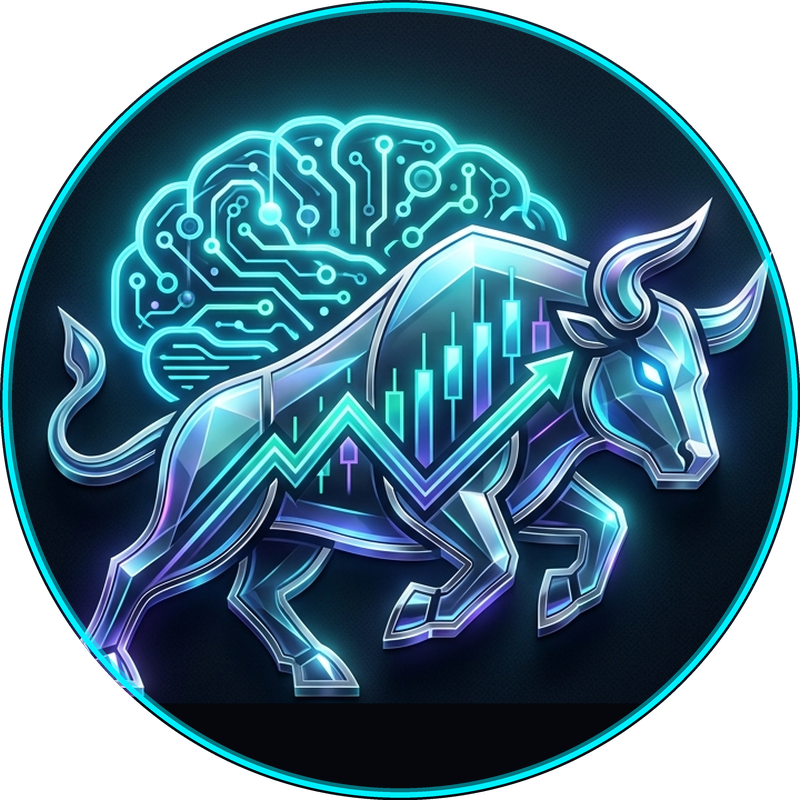
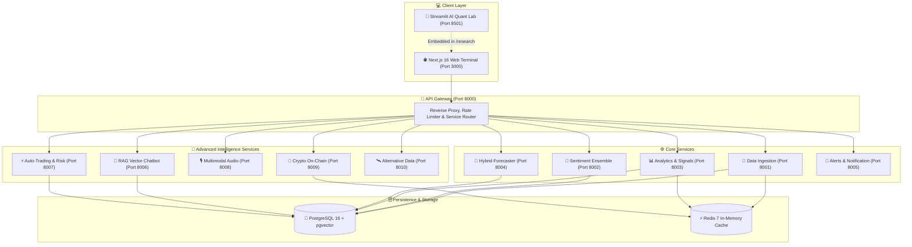
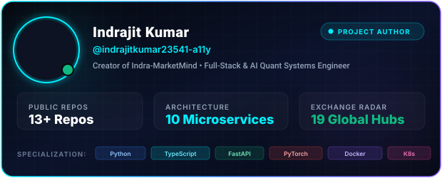

<div align="center">
  
  <a href="https://github.com/indrajitkumar23541-a11y/Indra-MarketMind">
    
  </a>

  <br><br>

  <a href="https://github.com/indrajitkumar23541-a11y/Indra-MarketMind">
    
  </a>
  
  <p align="center">
    <a href="https://github.com/indrajitkumar23541-a11y/Indra-MarketMind/stargazers"></a>
    <a href="https://github.com/indrajitkumar23541-a11y/Indra-MarketMind/network/members"></a>
    <a href="https://github.com/indrajitkumar23541-a11y/Indra-MarketMind/issues"></a>
    <a href="https://github.com/indrajitkumar23541-a11y/Indra-MarketMind/blob/main/LICENSE"></a>
    
    
    
  </p>

  
  
  <br>
  
  <table>
    <tr>
      <td align="center"><b>🐍 Python 3.10+</b></td>
      <td align="center"><b>⚡ FastAPI Mesh</b></td>
      <td align="center"><b>🧠 5-Model NLP Ensemble</b></td>
      <td align="center"><b>🔮 PyTorch & Prophet</b></td>
      <td align="center"><b>🌌 Next.js 16 UI</b></td>
      <td align="center"><b>🐳 Docker & K8s</b></td>
    </tr>
  </table>

</div>

---

## 📑 Table of Contents
- [🌟 Executive Summary](#-executive-summary)
- [✨ Core Breakthrough Features](#-core-breakthrough-features)
  - [1. 🌍 Worldwide Financial Exchanges Radar (19 Hubs)](#1--worldwide-financial-exchanges-radar-19-hubs)
  - [2. 📊 Real-World Functional Market Overview](#2--real-world-functional-market-overview)
  - [3. 🧠 5-Model NLP Sentiment Ensemble](#3--5-model-nlp-sentiment-ensemble)
  - [4. 🔮 Hybrid Deep Learning Forecaster](#4--hybrid-deep-learning-forecaster)
  - [5. ⚡ Automated Trading & Risk Manager](#5--automated-trading--risk-manager)
  - [6. 🎙️ Multimodal Audio Earnings Intelligence](#6-️-multimodal-audio-earnings-intelligence)
  - [7. 🐋 Crypto On-Chain & Alt Data Scrapers](#7--crypto-on-chain--alt-data-scrapers)
- [🏗️ Microservices System Architecture](#️-microservices-system-architecture)
- [🔌 Microservices Registry & Port Mapping](#-microservices-registry--port-mapping)
- [🚀 Quickstart & Setup Guide](#-quickstart--setup-guide)
- [☸️ Production Kubernetes Deployment](#️-production-kubernetes-deployment)
- [👑 Author & Visionary](#-author--visionary)
- [📝 License & Disclaimer](#-license--disclaimer)

---

## 🌟 Executive Summary

**Indra-MarketMind** is a state-of-the-art, institutional-grade AI market intelligence and algorithmic trading ecosystem created by **Indrajit Kumar**. Traditional financial terminals cost $30,000+ per year and provide raw statistics without reasoning. **Indra-MarketMind reads the market's mind**:

1. Ingests raw news, social streams, SEC Form 4 insider filings, and live tick streams across global exchanges.
2. Evaluates narrative polarity and institutional psychology using an ensemble of **5 state-of-the-art NLP models** (*FinBERT, RoBERTa-Financial, FinGPT, VADER, and TextBlob*).
3. Forecasts price trends with a **Hybrid Machine Learning pipeline** uniting Bayesian trend decomposition (*Prophet*) and deep sequential memory (*PyTorch Bi-LSTM*).
4. Monitors **19 global financial exchanges** in real time with timezone-aware trading sessions, official market hours, and live quote benchmarks.
5. Delivers all intelligence through a **single unified Dark Sci-Fi Web Terminal (`http://localhost:3000`)** built on Next.js 16, glassmorphism aesthetics, and instant keyboard search (`Ctrl + /`).

---

## ✨ Core Breakthrough Features

### 1. 🌍 Worldwide Financial Exchanges Radar (19 Hubs)
A premier geopolitical and market session radar visualizing 19 major global financial capitals on an interactive Mercator canvas:

<div align="center">

| Region | Exchanges & Benchmark Indices | Local Trading Hours | Live Detection |
|:---|:---|:---|:---|
| **Asia-Pacific** | 🇮🇳 **Mumbai** (NSE / NIFTY 50 `^NSEI`, SENSEX `^BSESN`)<br>🇯🇵 **Tokyo** (TSE / Nikkei 225 `^N225`)<br>🇭🇰 **Hong Kong** (HKEX / Hang Seng `^HSI`)<br>🇨🇳 **Shanghai** (SSE / SSE Composite `000001.SS`)<br>🇸🇬 **Singapore** (SGX / Straits Times `^STI`)<br>🇰🇷 **Seoul** (KRX / KOSPI `^KS11`)<br>🇦🇺 **Sydney** (ASX / ASX 200 `^AXJO`) | `09:15 - 15:30 IST`<br>`09:00 - 15:00 JST`<br>`09:30 - 16:00 HKT`<br>`09:30 - 15:00 CST`<br>`09:00 - 17:00 SGT`<br>`09:00 - 15:30 KST`<br>`10:00 - 16:00 AEST` | Real-time IANA timezone parsing (`Asia/Kolkata`, `Asia/Tokyo`, etc.) |
| **Europe** | 🇬🇧 **London** (LSE / FTSE 100 `^FTSE`)<br>🇩🇪 **Frankfurt** (FWB / DAX 40 `^GDAXI`)<br>🇫🇷 **Paris** (Euronext / CAC 40 `^FCHI`)<br>🇨🇭 **Zurich** (SIX / SMI `^SSMI`)<br>🇳🇱 **Amsterdam** (Euronext / AEX `^AEX`) | `08:00 - 16:30 GMT`<br>`09:00 - 17:30 CET`<br>`09:00 - 17:30 CET`<br>`09:00 - 17:30 CET`<br>`09:00 - 17:30 CET` | Auto daylight saving detection (`Europe/London`, `Europe/Berlin`) |
| **Americas** | 🇺🇸 **New York** (NYSE & NASDAQ / Dow `^DJI`, S&P 500 `^GSPC`, NDQ `^IXIC`)<br>🇨🇦 **Toronto** (TSX / TSX Composite `^GSPTSE`)<br>🇧🇷 **São Paulo** (B3 / IBOVESPA `^BVSP`)<br>🇲🇽 **Mexico City** (BMV / IPC `^MXX`) | `09:30 - 16:00 EST`<br>`09:30 - 16:00 EST`<br>`10:00 - 17:00 BRT`<br>`08:30 - 15:00 CST` | High-frequency Wall Street tick feeds |
| **Middle East & Africa** | 🇸🇦 **Riyadh** (Tadawul / TASI `^TASI.SR`)<br>🇦🇪 **Dubai** (DFM / DFM General `DFMGI.AE`)<br>🇿🇦 **Johannesburg** (JSE / Top 40 `^J203.JO`) | `10:00 - 15:00 AST (Sun-Thu)`<br>`10:00 - 15:00 GST (Mon-Fri)`<br>`09:00 - 17:00 SAST (Mon-Fri)` | Islamic trading calendar (Sunday–Thursday workweek for Riyadh) |

</div>

- **Pulsing Radar Waves:** Active open markets radiate glowing emerald ripples on the map.
- **Region Filter Tabs:** Filter instant nodes across `All`, `Asia-Pacific`, `Europe`, `Americas`, and `Middle East & Africa`.
- **World Financial Clocks:** Real-time local clocks for Mumbai, New York, London, Tokyo, and Sydney.

---

### 2. 📊 Real-World Functional Market Overview
- **100% Genuine Intraday Charts:** Dynamic timeframe selectors (`1D`, `1W`, `1M`, `3M`, `1Y`, `All`) with actual timestamped candles from market open to close.
- **Accurate Benchmark Pricing:** Calculates previous close accurately from historical session data.
- **27 Worldwide Assets with Sparklines:** Complete table monitoring NIFTY, SENSEX, BANK NIFTY, NASDAQ, S&P 500, DOW, BITCOIN, ETHEREUM, GOLD, CRUDE OIL, and 17 international indices.
- **Dynamic Greetings:** Changes automatically between `Good Morning, ☀️`, `Good Afternoon, 🌤️`, and `Good Evening, 🌙` based on client local time.
- **Global Search (`Ctrl + /`):** Instant search modal querying Indian stocks (RELIANCE, TCS, INFY, HDFC), US tech giants (AAPL, MSFT, NVDA, TSLA), and crypto pairs with live prices.
- **Notification Drawer:** Real-time bell drawer tracking volatility surges and whale alerts.

---

### 3. 🧠 5-Model NLP Sentiment Ensemble
The market is driven by human psychology and narrative momentum. MarketMind parses every article and tweet through 5 specialized AI models:

```
                  ┌─────────────────────────────────┐
                  │    Raw Financial Text Stream    │
                  └───────────────┬─────────────────┘
                                  ▼
        ┌──────────────────────────────────────────────────┐
        │          5-Model Parallel NLP Inference          │
        ├─────────────┬─────────────┬───────────┬──────────┤
        │   FinBERT   │   RoBERTa   │  FinGPT   │  VADER   │
        │ Transformer │ Deep Neural │ Generative│ Lexicon  │
        └──────┬──────┴──────┬──────┴─────┬─────┴────┬─────┘
               │             │            │          │
               ▼             ▼            ▼          ▼
        ┌──────────────────────────────────────────────────┐
        │  Weighted Ensemble Consensus Algorithm (-1 to 1) │
        └─────────────────────────┬────────────────────────┘
                                  ▼
                     [ +0.78 Bullish Sentiment ]
```

1. **FinBERT (HuggingFace):** Pretrained on financial 10-K, 10-Q filings, and earnings transcripts.
2. **RoBERTa-Financial:** Deep bidirectional transformer tuned on news headlines and analyst reports.
3. **FinGPT:** Instruction-tuned generative LLM providing reasoning behind market tone.
4. **VADER:** Optimized rule-based lexicon for fast social sentiment analysis.
5. **TextBlob:** Subjectivity vs. objectivity scoring.

---

### 4. 🔮 Hybrid Deep Learning Forecaster
Combines the strength of statistical time-series decomposition and non-linear deep learning:
- **Facebook Prophet:** Extracts macro trends, weekly seasonalities, and holiday effects.
- **PyTorch Bidirectional LSTM:** Consumes Prophet residuals alongside the 5-model sentiment composite to forecast upcoming volatility swings and target price corridors.

---

### 5. ⚡ Automated Trading & Risk Manager
- **Paper Trading Engine:** Full mock order execution (Market, Limit, Stop-Loss) with simulated slippage and commission tracking.
- **Risk Management System:**
  - Dynamic Position Sizing using the **Kelly Criterion**.
  - Value at Risk (**VaR**) calculation (95% & 99% confidence intervals).
  - Automated Max Drawdown kill-switch to protect capital.

---

### 6. 🎙️ Multimodal Audio Earnings Intelligence
- **OpenAI Whisper Audio Pipeline:** Ingests live earnings conference call audio recordings and investor presentations.
- Generates timestamped transcripts with speaker diarization and computes sentence-by-sentence executive sentiment polarity.

---

### 7. 🐋 Crypto On-Chain & Alt Data Scrapers
- **Whale Transaction Alerting:** Tracks high-value transfers across major blockchain networks.
- **Alternative Data Engine:** Correlates Google Search Trends, Reddit WallStreetBets discussion velocity, and Twitter/X viral metrics to detect retail sentiment shifts.

---

## 🏗️ Microservices System Architecture

Indra-MarketMind is built on an enterprise asynchronous microservices mesh orchestrated via Docker and Kubernetes:



---

## 🔌 Microservices Registry & Port Mapping

| Service Name | Port | Description & Responsibilities | Key Endpoints |
|:---|:---:|:---|:---|
| **API Gateway** | `8000` | Unified reverse proxy, routing mesh, and health monitor | `/api/system/status`, `/docs` |
| **Data Ingestion** | `8001` | Live Yahoo market feeds, news, Reddit, and SEC Edgar | `/fetch/market/{ticker}/quote`, `/fetch/market/indices/overview` |
| **Sentiment Engine**| `8002` | 5-Model NLP sentiment ensemble (FinBERT, RoBERTa, etc.) | `/analyze/sentiment`, `/analyze/ensemble` |
| **Analytics Engine**| `8003` | Technical indicators, Fear & Greed index, correlation | `/analytics/technical/{ticker}`, `/analytics/fear-greed` |
| **ML Forecaster** | `8004` | Prophet + PyTorch LSTM price forecasting engine | `/forecast/{ticker}`, `/forecast/hybrid` |
| **Alerts System** | `8005` | Real-time email, webhook, and Telegram dispatcher | `/alerts/trigger`, `/alerts/active` |
| **RAG Chatbot** | `8006` | LangChain financial assistant powered by pgvector | `/chat/query`, `/chat/context` |
| **Auto-Trading** | `8007` | Paper broker, risk management, and order execution | `/trade/order`, `/trade/portfolio` |
| **Multimodal Audio**| `8008` | Whisper speech-to-text earnings call analyzer | `/audio/transcribe`, `/audio/sentiment` |
| **Crypto On-Chain** | `8009` | Blockchain whale tracker and on-chain intelligence | `/crypto/whales`, `/crypto/gas` |
| **Alternative Data**| `8010` | Google Trends & social media volume scraper | `/altdata/trends`, `/altdata/volume` |
| **Web Terminal** | `3000` | Next.js 16 Dark Sci-Fi UI, Global Radar, Live Overview | `http://localhost:3000` |
| **AI Quant Lab** | `8501` | Streamlit quantitative lab (embedded inside `/research`) | `http://localhost:3000/research` |

---

## 🚀 Quickstart & Setup Guide

Launch the entire ecosystem locally in under 3 minutes:

### 1. Clone the Repository
```bash
git clone https://github.com/indrajitkumar23541-a11y/Indra-MarketMind.git
cd Indra-MarketMind
```

### 2. Configure Environment Variables
All external API keys are optional. The platform includes offline fallbacks and free live feeds out of the box:
```bash
# Windows
copy .env.example .env

# macOS / Linux
cp .env.example .env
```

### 3. Launch via Docker Compose
```bash
docker compose up --build
```

### 4. Access the Unified Web Terminal
Once containers are healthy, open:
👉 **[http://localhost:3000](http://localhost:3000)** — Next.js 16 Unified Financial Terminal  
👉 **[http://localhost:3000/global-map](http://localhost:3000/global-map)** — 19 Global Exchanges Radar  
👉 **[http://localhost:3000/research](http://localhost:3000/research)** — AI Quant Lab & NLP Ensemble  
👉 **[http://localhost:8000/docs](http://localhost:8000/docs)** — Interactive Swagger API Gateway  

---

## ☸️ Production Kubernetes Deployment

For enterprise high-availability and autoscaling:

```bash
# Apply complete Kubernetes manifests
kubectl apply -f k8s/namespace.yaml
kubectl apply -f k8s/configmap.yaml
kubectl apply -f k8s/secrets.yaml
kubectl apply -f k8s/postgres.yaml
kubectl apply -f k8s/redis.yaml
kubectl apply -f k8s/services-deployment.yaml
kubectl apply -f k8s/ingress.yaml
kubectl apply -f k8s/hpa.yaml
```

Check cluster health:
```bash
kubectl get pods -n indra-marketmind
kubectl get hpa -n indra-marketmind
```

For detailed cluster provisioning and ingress TLS setup, see [`k8s/README.md`](k8s/README.md).

---

## 💻 Elite Technology Stack

<p align="center">
  
  
  
  
  
  
  
  
  
  
  
  
</p>

---

## 👑 Author & Visionary

<div align="center">
  <a href="https://github.com/indrajitkumar23541-a11y">
    
  </a>
  <br><br>
  <a href="https://github.com/indrajitkumar23541-a11y">
    
  </a>
</div>

**Indra-MarketMind** is engineered and maintained with pride by **Indrajit Kumar**:
- 🌐 GitHub: [@indrajitkumar23541-a11y](https://github.com/indrajitkumar23541-a11y)
- 💼 Project Repository: [Indra-MarketMind](https://github.com/indrajitkumar23541-a11y/Indra-MarketMind)
- 💡 Passion: High-Performance Distributed Systems, AI Quantitative Finance & Autonomous Agents

---

## 📝 License & Disclaimer

This project is licensed under the **MIT License** — see the [LICENSE](LICENSE) file for details.

> [!CAUTION]
> **Financial & Investment Disclaimer:**  
> Indra-MarketMind is an advanced research and quantitative intelligence tool. It does **not** constitute financial, investment, legal, or tax advice. Past market sentiment or algorithmic predictions do not guarantee future performance. Always conduct independent verification before deploying real capital.

<div align="center">
  <br>
  
</div>
