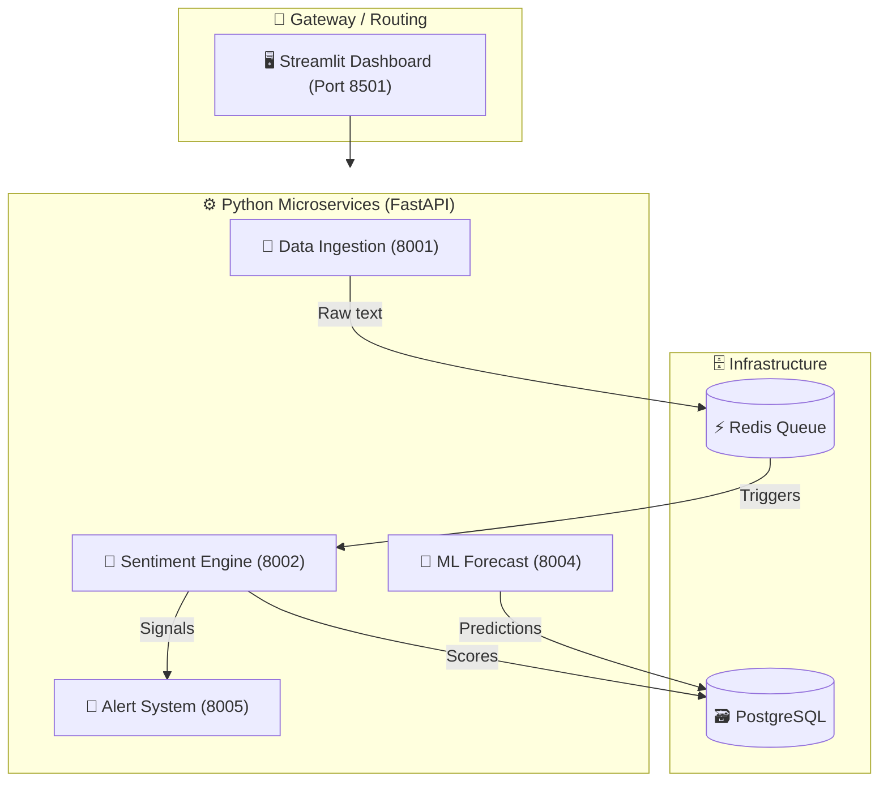

<div align="center">
  
  
  <h3>The World's Most Advanced AI-Powered Financial Intelligence Platform</h3>
  
  <p>
    Built with a microservices architecture, 5 NLP models, ML Forecasting, and Real-Time analytics to decode market emotions and predict trends.
  </p>

  <p>
    <a href="#-architecture">Architecture</a> • 
    <a href="#-core-features">Features</a> • 
    <a href="#-quickstart">Quickstart</a> • 
    <a href="#-tech-stack">Tech Stack</a>
  </p>
  
  <p>
    
    
    
    
  </p>
</div>

---

## 🚀 What is Indra-MarketMind?

**Indra-MarketMind** is an enterprise-grade, open-source market intelligence platform. While traditional tools look at historical prices, MarketMind uses cutting-edge Natural Language Processing (NLP) to read thousands of news articles, social media posts, and SEC filings in real-time to gauge **market sentiment**, and then feeds that sentiment into a **Deep Learning Forecasting Engine** to predict future price movements.

*Why pay $35,000/yr for Bloomberg when you can run Indra-MarketMind for free?*

## ✨ Core Features

| Feature | Description |
| :--- | :--- |
| 🌍 **Global Sentiment Map** | Track real-time bullish/bearish sentiment across 50+ global exchanges. |
| 🧠 **5-Model NLP Ensemble** | Uses FinBERT, RoBERTa, FinGPT, VADER, and TextBlob for unparalleled accuracy. |
| 🔮 **Hybrid ML Forecaster** | Combines Prophet (for baseline trends) and PyTorch LSTMs (for sentiment residuals). |
| 😱 **Fear & Greed Index** | A proprietary 7-factor gauge tracking momentum, volatility, and safe-haven demand. |
| 🔭 **Sector Rotation** | Visualize institutional money flow across 11 major market sectors. |
| 👔 **Insider Signals** | Track SEC Form 4 filings to see what CEOs and CFOs are doing with their money. |
| 🚨 **Automated Alerts** | Instant Telegram and Email alerts when critical market shifts occur. |
| 🖥️ **Ultra-Premium UI** | A stunning 10-page Streamlit dashboard with custom glassmorphism styling. |

---

## 🏗️ Architecture

Indra-MarketMind is built on a highly scalable **Microservices Architecture**.



---

## ⚡ Quickstart

Getting Indra-MarketMind up and running is incredibly simple using Docker.

### Prerequisites
- Docker & Docker Compose installed.
- Git.

### 1. Clone the repository
```bash
git clone https://github.com/indrajitkumar23541-a11y/Indra-MarketMind.git
cd Indra-MarketMind
```

### 2. Configure Environment Variables
Copy the `.env.example` file to `.env` and add your API keys (NewsAPI, Finnhub, Telegram Bot).
```bash
cp .env.example .env
```
*(Note: Even without API keys, the system will use smart mock fallbacks so you can test the UI!)*

### 3. Launch the Cluster
```bash
docker-compose up --build
```

### 4. Access the Platform
Once the containers are running, open your browser and navigate to:
👉 **[http://localhost:8501](http://localhost:8501)**

---

## 💻 Tech Stack

- **Backend Framework**: `FastAPI`
- **Data Science / ML**: `PyTorch`, `Prophet`, `Scikit-Learn`, `Pandas`, `NumPy`
- **NLP Models**: `HuggingFace Transformers`, `FinBERT`, `NLTK`, `TextBlob`
- **Frontend / UI**: `Streamlit`, `Plotly`, `Custom CSS (Glassmorphism)`
- **Database / Cache**: `PostgreSQL 16`, `Redis 7`
- **Orchestration**: `Docker`, `Docker Compose`, `APScheduler`

---

## 🤝 Contributing

Contributions are what make the open source community such an amazing place to learn, inspire, and create. Any contributions you make are **greatly appreciated**.

1. Fork the Project
2. Create your Feature Branch (`git checkout -b feature/AmazingFeature`)
3. Commit your Changes (`git commit -m 'Add some AmazingFeature'`)
4. Push to the Branch (`git push origin feature/AmazingFeature`)
5. Open a Pull Request

---

## 📝 License

Distributed under the MIT License. See `LICENSE` for more information.

---
<div align="center">
  <b>Built with ❤️ by <a href="https://github.com/indrajitkumar23541-a11y">Indrajit Kumar</a></b>
  <br><br>
  <i>"Markets are moved by emotions. We decode the emotions."</i>
</div>
