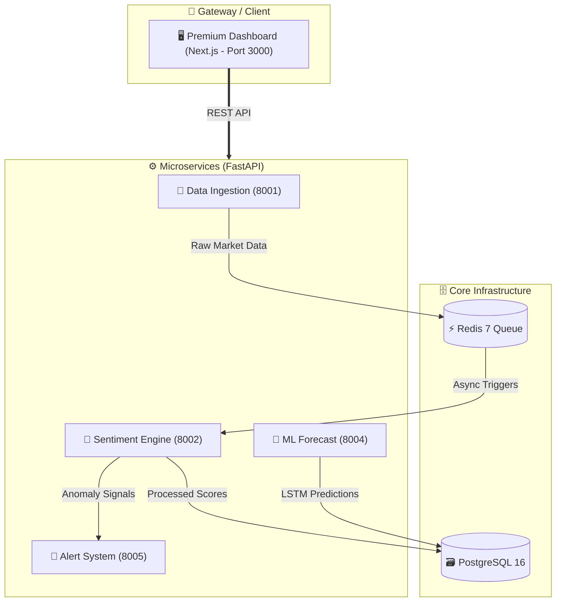

<div align="center">
  
  <a href="https://github.com/indrajitkumar23541-a11y/Indra-MarketMind">
    
  </a>
  
  <p align="center">
    <a href="https://github.com/indrajitkumar23541-a11y/Indra-MarketMind/stargazers"></a>
    <a href="https://github.com/indrajitkumar23541-a11y/Indra-MarketMind/network/members"></a>
    <a href="https://github.com/indrajitkumar23541-a11y/Indra-MarketMind/issues"></a>
    <a href="https://github.com/indrajitkumar23541-a11y/Indra-MarketMind/blob/main/LICENSE"></a>
  </p>

  
  
  <br>
  
  <table>
    <tr>
      <td align="center">Python 3.10+</td>
      <td align="center">FastAPI</td>
      <td align="center">PyTorch & NLP</td>
      <td align="center">Next.js 14 UI</td>
      <td align="center">Docker Ready</td>
    </tr>
  </table>

</div>

---

## 🚀 Welcome to the Future of Trading

**Indra-MarketMind** is a state-of-the-art, enterprise-grade open-source market intelligence platform. Created exclusively by **Indrajit Kumar**, this system doesn't just look at numbers—it reads the market's mind.

By utilizing a highly parallelized Microservices architecture, it ingests millions of data points across global news, social media, and SEC filings. It then processes them through an ensemble of **5 cutting-edge NLP models** to quantify market emotion, feeding this directly into a **Deep Learning Hybrid Forecaster** to predict price action before it happens.

> *Why pay $35,000/yr for traditional terminal software when you can run a superior AI brain locally?*

---

## ✨ Features That Defy Gravity

<div align="center">
  <table>
    <tr>
      <td width="50%" align="center">
        <h3>🧠 5-Model NLP Ensemble</h3>
        <p>Utilizes <i>FinBERT, RoBERTa, FinGPT, VADER, and TextBlob</i> working in harmony to score sentiment with unparalleled accuracy.</p>
      </td>
      <td width="50%" align="center">
        <h3>🌌 Premium UI</h3>
        <p>A custom-built Next.js + React frontend featuring Dark Sci-Fi Neumorphism, glassmorphism layers, and dynamic interactive charts.</p>
      </td>
    </tr>
    <tr>
      <td width="50%" align="center">
        <h3>🔮 Hybrid ML Forecasting</h3>
        <p>Combines Facebook Prophet (for baseline trends) and PyTorch LSTMs (for sentiment-driven volatility spikes).</p>
      </td>
      <td width="50%" align="center">
        <h3>🔭 3D Sector Rotation</h3>
        <p>Visualize institutional money flow across 11 major market sectors in a stunning interactive 3D WebGL space.</p>
      </td>
    </tr>
  </table>
</div>

### 🔥 More Core Modules
- 🌍 **Global Sentiment Map:** Track real-time bullish/bearish heatmaps across 50+ global exchanges.
- 😱 **Fear & Greed Index:** A proprietary 7-factor gauge tracking momentum, volatility, and safe-haven demand.
- 👔 **Insider Signals:** Track SEC Form 4 filings to see what CEOs and CFOs are doing with their capital.
- 🚨 **Automated Alerts:** Instant Telegram and Email alerts when critical market shifts occur.

---

## 🏗️ The Neural Architecture

Indra-MarketMind is engineered for massive scale and extreme low-latency using asynchronous Python microservices.



---

## ⚡ Quickstart Guide

Getting your personal AI financial terminal online takes less than 3 minutes.

### Prerequisites
- **Docker** & **Docker Compose** installed on your machine.
- Git.

### 1. Clone the Brain
```bash
git clone https://github.com/indrajitkumar23541-a11y/Indra-MarketMind.git
cd Indra-MarketMind
```

### 2. Configure the Synapses
Copy the example environment file and insert your API keys (NewsAPI, Finnhub, etc.).
```bash
cp .env.example .env
```
*(No API keys? No problem. The system will automatically use intelligent mock fallbacks so you can explore the UI immediately!)*

### 3. Ignite the Backend Cluster
```bash
docker-compose up --build
```

### 4. Start the Next.js Frontend
Open a new terminal window:
```bash
cd frontend
npm install
npm run dev
```

### 5. Enter the Dashboard
Once the microservices achieve harmony, open your browser and witness the magic:
👉 **[http://localhost:3000](http://localhost:3000)**

---

## 💻 Elite Tech Stack

<p align="center">
  
  
  
  
  
  
  
  
</p>

---

## 👑 About the Creator

<div align="center">
  <a href="https://github.com/indrajitkumar23541-a11y">
    
  </a>
</div>

This platform is a testament to the intersection of Artificial Intelligence and Finance. Built from the ground up by **Indrajit Kumar**.

---

## 📝 License & Disclaimer

Distributed under the MIT License. See `LICENSE` for more information.

> **Disclaimer:** Indra-MarketMind is an intelligence tool, not a financial advisor. The AI predictions and sentiment scores are for educational and research purposes only. Always do your own due diligence before trading.

<div align="center">
  <br>
  
</div>
