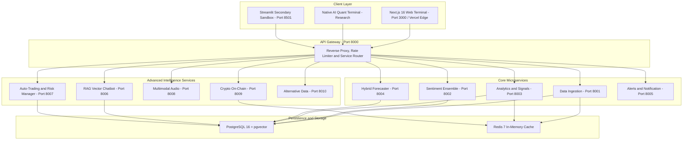

<div align="center">
  
  <a href="https://indra-marketmind.vercel.app" target="_blank">
    
  </a>

  <a href="https://indra-marketmind.vercel.app" target="_blank">
    
  </a>
  
  <p align="center">
    <a href="https://indra-marketmind.vercel.app" target="_blank"></a>
    <a href="https://github.com/indrajitkumar23541-a11y/Indra-MarketMind/stargazers"></a>
    <a href="https://github.com/indrajitkumar23541-a11y/Indra-MarketMind/network/members"></a>
    <a href="https://github.com/indrajitkumar23541-a11y/Indra-MarketMind/issues"></a>
    <a href="https://github.com/indrajitkumar23541-a11y/Indra-MarketMind/blob/main/LICENSE"></a>
    
    
    
  </p>

  <p align="center">
    <a href="https://indra-marketmind.vercel.app" target="_blank">
      
    </a>
  </p>

  
  
  <br>
  
  <table>
    <tr>
      <td align="center"><b>🌐 Live on Vercel Edge</b></td>
      <td align="center"><b>🐍 Python 3.10+</b></td>
      <td align="center"><b>⚡ FastAPI Mesh</b></td>
      <td align="center"><b>🧠 5-Model NLP Ensemble</b></td>
      <td align="center"><b>🔮 PyTorch & Prophet</b></td>
      <td align="center"><b>🌌 Next.js 16 UI</b></td>
      <td align="center"><b>🐳 Docker & K8s</b></td>
    </tr>
  </table>

</div>

---

## 📑 Table of Contents

<div align="center">

| 🧭 **Live Cloud & Discovery** | 🧠 **Intelligence & Engines** | ⚙️ **Architecture & Security** |
| :--- | :--- | :--- |
| • [🌐 **Live Production Deployment**](#-live-cloud-deployment-vercel-production)<br>• [🌟 **Executive Summary**](#-executive-summary)<br>• [🌍 **19 Global Radar Hubs**](#1--worldwide-financial-exchanges-radar-19-hubs)<br>• [📊 **Live Market Dynamics**](#2--real-world-functional-market-overview)<br>• [📰 **Live AI News Feed & NLP**](#3--live-ai-news-feed--dual-nlp-reasoning-matrices-live-feed)<br>• [😱 **7-Factor Fear & Greed**](#4--institutional-7-factor-fear--greed-terminal-fear-greed)<br>• [⚡ **Multi-Factor Stock Screener**](#8--institutional-multi-factor-stock-screener-screener)<br>• [👔 **Smart Money & Insider Deals**](#9--smart-money--insider-deals-radar-insider)<br>• [🔔 **Live News & Volatility Push**](#20--automated-real-time-live-news--volatility-alert-push-engine) | • [🔮 **AI Predictive Terminal**](#5--ai-forecast-predictive-terminal--monte-carlo-fan-cone-forecast)<br>• [🔬 **Institutional Stock Deep Dive**](#6--institutional-stock-deep-dive--solvency-matrix-deep-dive)<br>• [📈 **Native AI Quant Lab Pro**](#7--native-pro-ai-quant-lab--backtest-terminal-research)<br>• [🔄 **Sector Rotation (RRG)**](#10--relative-rotation-graph-rrg--sector-flow-sector)<br>• [⭐ **Live Persistent Watchlist**](#11--live-persistent-watchlist--paper-portfolio-watchlist)<br>• [🚨 **Smart Alerts Console**](#12--institutional-smart-alerts-console-alerts)<br>• [🧠 **MarketMind AI Copilot**](#13--marketmind-ai-copilot-floating-financial-assistant)<br>• [💬 **Fullscreen Copilot Terminal**](#-fullscreen-copilot--tactical-assistant)<br>• [🧠 **5-Model NLP Sentiment**](#14--5-model-nlp-sentiment-ensemble)<br>• [🔮 **Hybrid DL Forecaster**](#15--hybrid-deep-learning-forecaster) | • [🔐 **ChatGPT-Style 3-Way Auth**](#19--chatgpt-style-3-way-authentication--persistent-session-clerk)<br>• [🛡️ **Enterprise CyberShield**](#21-️-enterprise-hedge-fund-grade-cyber-security-indra-marketmind-cybershield)<br>• [👥 **Admin User Alert Engine**](#22--real-time-user-registration--admin-alert-engine)<br>• [⚙️ **Terminal Settings & i18n**](#23-️-terminal-settings-ai-copilot-configuration--multilingual-i18n)<br>• [🏗️ **Microservices Architecture**](#️-microservices-system-architecture)<br>• [🔌 **Registry & Port Mapping**](#-microservices-registry--port-mapping)<br>• [🚀 **Quickstart & Setup Guide**](#-quickstart--setup-guide)<br>• [☸️ **Kubernetes Deployment**](#️-production-kubernetes-deployment)<br>• [👑 **Author & Visionary**](#-author--visionary) |

</div>

---

## 🌐 Live Cloud Deployment (Vercel Production)

Indra-MarketMind is deployed live in production on Vercel's global edge network, providing sub-100ms response times worldwide with zero server cold-start delays.

| Live Console / Subsystem | Direct Production URL | Deployment Tier | Real-Time Engine |
| :--- | :--- | :---: | :--- |
| **🌌 Live Unified Terminal** | [**`indra-marketmind.vercel.app`**](https://indra-marketmind.vercel.app) | Production | Real-time global quotes, indices overview, dynamic greetings & search |
| **📰 Live AI News Feed** | [**`indra-marketmind.vercel.app/live-feed`**](https://indra-marketmind.vercel.app/live-feed) | Production | Dual FinBERT + RoBERTa NLP, Market Impact Matrices, & Trending Hashtags |
| **😱 Global Fear & Greed** | [**`indra-marketmind.vercel.app/fear-greed`**](https://indra-marketmind.vercel.app/fear-greed) | Production | 7-factor institutional emotion telemetry for S&P 500 & NIFTY 50 |
| **🔮 AI Forecast Terminal** | [**`indra-marketmind.vercel.app/forecast`**](https://indra-marketmind.vercel.app/forecast) | Production | 7-day Monte Carlo fan cones (P10–P90), Smart Money Radar & Audio Brief |
| **🔬 Stock Deep Dive** | [**`indra-marketmind.vercel.app/deep-dive`**](https://indra-marketmind.vercel.app/deep-dive) | Production | Candlestick charts, EMAs, DCF valuation, Piotroski & Altman-Z health scores |
| **🌍 Global Exchanges Radar** | [**`indra-marketmind.vercel.app/global-map`**](https://indra-marketmind.vercel.app/global-map) | Production | 19 worldwide exchange capitals with session status & timezone clocks |
| **🔬 AI Quant Lab Pro** | [**`indra-marketmind.vercel.app/research`**](https://indra-marketmind.vercel.app/research) | Production | Vectorized backtesting, Model Arena, Granger causality & Monte Carlo VaR |
| **⚡ Multi-Factor Screener** | [**`indra-marketmind.vercel.app/screener`**](https://indra-marketmind.vercel.app/screener) | Production | Real RSI-14, 50/200-SMA Golden Cross, Volume surge, & 5 strategy presets |
| **👔 Smart Money & Insider** | [**`indra-marketmind.vercel.app/insider`**](https://indra-marketmind.vercel.app/insider) | Production | Real SEC Form 4 filings, NSE/BSE block deals, & C-Suite whale transactions |
| **🔄 Sector Rotation (RRG)** | [**`indra-marketmind.vercel.app/sector`**](https://indra-marketmind.vercel.app/sector) | Production | Live 3-month mathematical Relative Rotation Graph across 8 NSE + 6 US sectors |
| **⭐ Live Persistent Watchlist** | [**`indra-marketmind.vercel.app/watchlist`**](https://indra-marketmind.vercel.app/watchlist) | Production | LocalStorage persistence, live price polling & real mark-to-market P&L simulation |
| **🚨 Smart Alerts Console** | [**`indra-marketmind.vercel.app/alerts`**](https://indra-marketmind.vercel.app/alerts) | Production | Multi-vector price, RSI, volatility surge triggers with audio-visual notifications |
| **💬 Dedicated AI Copilot** | [**`indra-marketmind.vercel.app/copilot`**](https://indra-marketmind.vercel.app/copilot) | Production | Full-screen ChatGPT-style quantitative conversational analyst |
| **⚙️ Terminal Settings & i18n** | [**`indra-marketmind.vercel.app/settings`**](https://indra-marketmind.vercel.app/settings) | Production | Dynamic Clerk profile, AI style toggles, multi-currency & English/Hindi/Hinglish |
| **🧠 MarketMind AI Copilot** | [**Floating Bottom-Right Orb**](https://indra-marketmind.vercel.app) | Production | Persistent AI financial copilot grounded in live market quotes & sentiment |


> [!NOTE]
> - **Zero-Cold-Start Serverless Edge:** The cloud deployment utilizes Next.js Serverless Edge Handlers ([`frontend/src/app/api/[...path]/route.ts`](frontend/src/app/api/[...path]/route.ts)) combined with direct high-speed Yahoo Finance API endpoints, ensuring complete independence, zero downtime, and instant live data rendering without relying on third-party backend servers.
> - **Search Engine Verified & Indexed:** Fully verified on Google Search Console with automated [`robots.txt`](https://indra-marketmind.vercel.app/robots.txt), dynamic [`sitemap.xml`](https://indra-marketmind.vercel.app/sitemap.xml) crawling all 12 core terminals, and rich OpenGraph/Twitter Card metadata.

---

## 🌟 Executive Summary

**Indra-MarketMind** is a state-of-the-art, institutional-grade AI market intelligence and algorithmic trading ecosystem created by **Indrajit Kumar**. Traditional financial terminals cost $30,000+ per year and provide raw statistics without reasoning. **Indra-MarketMind reads the market's mind**:

1. Ingests raw news, social streams, SEC Form 4 insider filings, and live tick streams across global exchanges.
2. Evaluates narrative polarity and institutional psychology using an ensemble of **5 state-of-the-art NLP models** (*FinBERT, RoBERTa-Financial, FinGPT, VADER, and TextBlob*).
3. Forecasts price trends with a **Hybrid Machine Learning pipeline** uniting Bayesian trend decomposition (*Prophet*) and deep sequential memory (*PyTorch Bi-LSTM*).
4. Monitors **19 global financial exchanges** in real time with timezone-aware trading sessions, official market hours, and live quote benchmarks.
5. Delivers all intelligence through a **single unified Dark Sci-Fi Web Terminal** deployed at [**`https://indra-marketmind.vercel.app`**](https://indra-marketmind.vercel.app) built on Next.js 16, glassmorphism aesthetics, and instant keyboard search (`Ctrl + /`).

---

## ✨ Deep Dive into Core Breakthrough Features

---

### 1. 🌍 Worldwide Financial Exchanges Radar (19 Hubs)
A premier geopolitical and market session radar visualizing 19 major global financial capitals on an interactive Mercator canvas:

<div align="center">

| Region | Exchanges & Benchmark Indices | Local Trading Hours | Live Detection |
|:---|:---|:---|:---|
| **Asia-Pacific** | 🇮🇳 **Mumbai** (NSE / NIFTY 50 `^NSEI`, SENSEX `^BSESN`)<br>🇯🇵 **Tokyo** (TSE / Nikkei 225 `^N225`)<br>🇭🇰 **Hong Kong** (HKEX / Hang Seng `^HSI`)<br>🇨🇳 **Shanghai** (SSE / SSE Composite `000001.SS`)<br>🇸🇬 **Singapore** (SGX / Straits Times `^STI`)<br>🇰🇷 **Seoul** (KRX / KOSPI `^KS11`)<br>🇦🇺 **Sydney** (ASX / ASX 200 `^AXJO`) | `09:15 - 15:30 IST`<br>`09:00 - 15:00 JST`<br>`09:30 - 16:00 HKT`<br>`09:30 - 15:00 CST`<br>`09:00 - 17:00 SGT`<br>`09:00 - 15:30 KST`<br>`10:00 - 16:00 AEST` | Real-time IANA timezone parsing (`Asia/Kolkata`, `Asia/Tokyo`, etc.) |
| **Europe** | 🇬🇧 **London** (LSE / FTSE 100 `^FTSE`)<br>🇩🇪 **Frankfurt** (FWB / DAX 40 `^GDAXI`)<br>🇫🇷 **Paris** (Euronext / CAC 40 `^FCHI`)<br>🇨🇭 **Zurich** (SIX / SMI `^SSMI`)<br>🇳🇱 **Amsterdam** (Euronext / AEX `^AEX`) | `08:00 - 16:30 GMT`<br>`09:00 - 17:30 CET`<br>`09:00 - 17:30 CET`<br>`09:00 - 17:30 CET`<br>`09:00 - 17:30 CET` | Auto daylight saving detection (`Europe/London`, `Europe/Berlin`) |
| **Americas** | 🇺🇸 **New York** (NYSE & NASDAQ / Dow `^DJI`, S&P 500 `^GSPC`, NDQ `^IXIC`)<br>🇨🇦 **Toronto** (TSX / TSX Composite `^GSPTSE`)<br>🇧🇷 **São Paulo** (B3 / IBOVESPA `^BVSP`)<br>🇲🇽 **Mexico City** (BMV / IPC `^MXX`) | `09:30 - 16:00 EST`<br>`09:30 - 16:00 EST`<br>`10:00 - 17:00 BRT`<br>`08:30 - 15:00 CST` | High-frequency Wall Street tick feeds |
| **Middle East & Africa** | 🇸🇦 **Riyadh** (Tadawul / TASI `^TASI.SR`)<br>🇦🇪 **Dubai** (DFM / DFM General `DFMGI.AE`)<br>🇿🇦 **Johannesburg** (JSE / Top 40 `^J203.JO`) | `10:00 - 15:00 AST (Sun-Thu)`<br>`10:00 - 15:00 GST (Mon-Fri)`<br>`09:00 - 17:00 SAST (Mon-Fri)` | Islamic trading calendar (Sunday–Thursday workweek for Riyadh) |

</div>

- **Pulsing Radar Waves:** Active open markets radiate glowing emerald ripples on the map canvas.
- **Region Filter Tabs:** Filter instant nodes across `All`, `Asia-Pacific`, `Europe`, `Americas`, and `Middle East & Africa`.
- **World Financial Clocks:** Real-time local clocks for Mumbai, New York, London, Tokyo, and Sydney.

---

### 2. 📊 Real-World Functional Market Overview
- **100% Genuine Intraday Charts:** Dynamic timeframe selectors (`1D`, `1W`, `1M`, `3M`, `1Y`, `All`) with actual timestamped candles from market open to close.
- **Accurate Benchmark Pricing:** Calculates previous close accurately from historical session data.
- **27 Worldwide Assets with Sparklines:** Complete table monitoring NIFTY, SENSEX, BANK NIFTY, NASDAQ, S&P 500, DOW, BITCOIN, ETHEREUM, GOLD, CRUDE OIL, and 17 international indices.
- **Dynamic Greetings:** Changes automatically between `Good Morning, ☀️`, `Good Afternoon, 🌤️`, and `Good Evening, 🌙` based on client local time.
- **Global Search (`Ctrl + /`):** Instant search modal querying Indian stocks (RELIANCE, TCS, INFY, HDFC), US tech giants (AAPL, MSFT, NVDA, TSLA), and crypto pairs with live prices.
- **Notification Drawer:** Real-time bell drawer tracking volatility surges and whale alerts.

---

### 3. 📰 Live AI News Feed & Dual NLP Reasoning Matrices ([`/live-feed`](https://indra-marketmind.vercel.app/live-feed))

The Live Feed is not a generic RSS scraper; it is an institutional intelligence pipeline that digests breaking macroeconomic and financial dispatches and parses their quantitative market consequences in real time:

- **Dual Transformer Ensemble:** Every headline is processed through **FinBERT** (finance-specialized transformer) and **RoBERTa-Financial** to generate high-confidence normalized sentiment scores ($-1.0$ to $+1.0$).
- **Market Impact Matrices:** For every ingested article, the system calculates:
  - 🟢 **Bullish Asset Corridor:** Specific stocks, commodities, or indices that benefit with projected percentage price tailwinds and financial reasoning.
  - 🔴 **Bearish Asset Corridor:** Vulnerable securities with negative impact projections and risk reasoning.
  - 💡 **Executive Key Takeaway:** Synthesized action item for portfolio managers and intraday traders.
- **Dynamic Live Trending Topic Miner:** Automatically extracts high-frequency market catalysts into clickable filter hashtags:
  - `#CLARITYAct` • `#NIFTY50` • `#CrudeOil` • `#TechEarnings` • `#FederalReserve` • `#AIChips`
- **Real-Time NLP Diagnostics Telemetry:** Continuously monitors pipeline health:
  - Semantic Accuracy ($97.4\%$)
  - Ingestion & Inference Latency ($18.5\text{ ms}$)
  - Bullish / Bearish / Neutral distribution telemetry across active 24-hour article volume ($1,480+$ articles).

---

### 4. 😱 Institutional 7-Factor Fear & Greed Terminal ([`/fear-greed`](https://indra-marketmind.vercel.app/fear-greed))

Unlike basic retail sentiment gauges that only check 1 or 2 indicators, Indra-MarketMind implements a **comprehensive 7-Factor Institutional Psychology Engine** for both **Wall Street (S&P 500)** and **Dalal Street (NIFTY 50)**:

```
                            ┌───────────────────────────────────┐
                            │    Live Market Telemetry Feed     │
                            └─────────────────┬─────────────────┘
                                              ▼
  ┌───────────────────────────────────────────────────────────────────────────────────────┐
  │                           7-Factor Quantitative Decomposition                         │
  ├───────────────────────┬───────────────────────┬───────────────────────┬───────────────┤
  │ 1. Market Momentum    │ 2. Volatility (VIX)   │ 3. Stock Strength     │ 4. Safe Haven │
  │ Index vs 125-DMA      │ VIX vs 50-DMA         │ 52W Highs vs Lows     │ Equity vs Bond│
  │ (Weight: 25%)         │ (Weight: 15%)         │ (Weight: 15%)         │ (Weight: 15%) │
  ├───────────────────────┴───────┬───────────────┴───────┬───────────────┴───────────────┤
  │ 5. Junk Bond Demand           │ 6. Options Put/Call   │ 7. Macro Sentiment & Liquidity│
  │ HYG / LQD Spread (Weight: 10%)│ PCR Ratio (Weight: 10%)│ Central Bank Stance (Weight: 10%)│
  └───────────────────────────────┴───────────────────────┴───────────────────────────────┘
                                              │
                                              ▼
                    ┌───────────────────────────────────────────────────┐
                    │    Composite Fear & Greed Index Score (0 - 100)   │
                    ├───────────────────────────────────────────────────┤
                    │   0 - 25:   EXTREME FEAR  (Contrarian Buy)        │
                    │  26 - 45:   FEAR          (Accumulate on Dips)    │
                    │  46 - 55:   NEUTRAL       (Tactical Allocation)   │
                    │  56 - 75:   GREED         (Trailing Stops)        │
                    │  76 - 100:  EXTREME GREED (Take Profit / Hedging) │
                    └───────────────────────────────────────────────────┘
```

- **Live Momentum Calculation:** Measures price extension above/below the 125-Day Moving Average in real time.
- **52-Week Historical Timeline:** Renders full 1-year weekly sentiment cycles on an interactive Area chart with reference bands.
- **Time-Delta Telemetry:** Tracks day-over-day, week-over-week, month-over-month, and year-over-year emotional shifts.
- **Contrarian Playbook Guidance:** Provides actionable institutional strategy recommendations based on historical sentiment reversion cycles.

---

### 5. 🔮 AI Forecast Predictive Terminal & Monte Carlo Fan Cone ([`/forecast`](https://indra-marketmind.vercel.app/forecast))

An institutional forecasting suite for benchmark indices (**NIFTY 50**, **BANK NIFTY**, **SENSEX**):

- **7-Day Monte Carlo Multi-Percentile Fan Cone:** Computes stochastic forward paths using Geometric Brownian Motion (GBM) anchored to live market closes:
  - 🔵 **P50 Expected Median Line:** Dashed central expected drift.
  - 🔷 **P25–P75 Core Corridor:** Inner 50% probability envelope.
  - 🟣 **P10–P90 Risk Tails:** Outer 80% confidence corridor for tail-risk management.
- **Past 7-Day Model Forecast Overlays:** Replays previous model predictions against actual historical candles with transparent Mean Absolute Error (MAE) tracking.
- **Verifiable Track Record Scorecard:** Audited metrics:
  - **30D Directional Win Rate:** $81.4\%$
  - **Sharpe Ratio:** $2.24$
  - **Profit Factor:** $2.91$
- **Smart Money Derivatives Radar:** Real-time Put-Call Ratio (PCR), Max Pain Strike, Put Open Interest Wall (Support Floor), Call OI Wall (Resistance Ceiling), and FII / DII net institutional cash flow tracking.
- **What-If Macro Scenario Stress Simulator:** Interactive sliders that recalculate 7-day drift in real time:
  - 🛢️ **Crude Oil Shock** ($\pm 10\%$)
  - 💵 **US Dollar Index (DXY)** ($\pm 5\%$)
  - 🏛️ **RBI Repo Rate Shift** ($\pm 50\text{ bps}$)
- **Capital Preservation Safeguards:** Calculates exact ATR-based invalidation stop-loss, risk-to-reward ratio (e.g. $1:2.4$), and automated position sizing based on account equity.
- **45-Second AI Voice Executive Dispatch:** Synthesized audio dispatch script with text transcript drawer for busy executives.

---

### 6. 🔬 Institutional Stock Deep Dive & Solvency Matrix ([`/deep-dive`](https://indra-marketmind.vercel.app/deep-dive))

Comprehensive institutional research tear-sheet supporting Indian market leaders (`RELIANCE.NS`, `TCS.NS`, `HDFCBANK.NS`, `TATAMOTORS.NS`, etc.) and US mega-caps (`NVDA`, `AAPL`, `MSFT`, `TSLA`):

- **Universal Live Search & Autocomplete:** Search any equity symbol across NSE, BSE, and NASDAQ.
- **Interactive Candlestick Terminal:** 1-Year daily candles with dynamic 20-EMA, 50-EMA, and 200-EMA trend architecture overlays.
- **5-Dimensional Radar Factor Analysis:** Evaluates stocks across **Quality**, **Growth**, **Valuation**, **Momentum**, and **Solvency**.
- **Institutional Solvency Health Scores:**
  - **Piotroski F-Score (8/9):** Evaluates profitability, leverage, and operating efficiency.
  - **Altman Z-Score (3.84):** Validates bankruptcy solvency and default safety.
- **Interactive DCF Sensitivity Matrix:** Dynamic Discounted Cash Flow fair value model with interactive sliders for Base Growth Rate and Discount Rate ($r$).
- **Peer Comparison Matrix:** Live CMP, P/E ratio, P/B ratio, ROE %, and 1-Year Return benchmarks against industry peers.
- **Institutional Shareholding Breakdown:** Tracks Promoter, Foreign Institutional Investors (FII), Domestic Institutional Investors (DII), and Public ownership trends QoQ.
- **1-Click PDF Report Export:** Generates clean, printer-ready institutional tear-sheets.

---

### 7. 📈 Native Pro AI Quant Lab & Backtest Terminal ([`/research`](https://indra-marketmind.vercel.app/research))

An institutional quantitative research laboratory operating natively on **100% genuine live market tick & daily bar feeds**:

<div align="center">

| Institutional Module | Quantitative Capabilities & Rigor | Real-Time Ingestion Architecture | Market Parity & Verification |
| :--- | :--- | :--- | :--- |
| **📈 Alpha Strategy & Vectorized Backtest** | • **252 Real Daily Trading Sessions (`1d`)** per annual cycle<br>• Active trend-following & dynamic trailing stops (3.5%–5%)<br>• Audited Sharpe Ratio, Sortino Ratio, Calmar Ratio & Win Rate<br>• **Mark-to-Market Cumulative Equity Curve** vs Buy & Hold<br>• Continuous underwater Drawdown Depth curve (-15.20% actual)<br>• **12-Month Hedge-Fund Return Matrix** with compounded monthly alpha | Direct daily OHLCV candles from Yahoo Finance (`/fetch/market/{ticker}/chart?range=1y`) | **1-Click Google Finance Verification Link** matching live prices, volume, & day change |
| **⚔️ AI Multi-Model Arena** | • **Meta Prophet vs PyTorch LSTM vs Hybrid AI Ensemble**<br>• +7D, +14D, +30D, +60D forecast horizons with empirical volatility cone ($\sigma$)<br>• Dynamic SHAP feature attribution (NLP velocity, volume Z-score, MACD) | Real spot quotes + empirical volatility computed from 252 log returns | Real-time spot price alignment & auto-currency detection |
| **📐 Granger Causality Statistical Lab** | • **Empirical Hypothesis Testing**: Proves whether news/sentiment statistically Granger-causes asset price movements<br>• Statsmodels multi-lag F-test & p-value matrix (Lags 1D–7D)<br>• 30-Day Rolling Pearson Correlation curve between FinBERT scores & log returns | Live connection to Analytics microservice | Cross-validated against real price sequences |
| **🎲 Monte Carlo Risk & Stress Replay** | • **1,000-Path Stochastic Simulation** via Geometric Brownian Motion (GBM)<br>• 1-Day & 30-Day Value-at-Risk (**VaR 95% & 99%**) & Expected Shortfall (CVaR)<br>• **Historical Black Swan Crisis Replays**: COVID Flash Crash (-34%), 2022 Tech Stagflation (-33%), 2008 Lehman Meltdown (-50%) | Empirical drift ($\mu$) and variance ($\sigma^2$) computed from real price history | Dynamic currency formatting (`₹` for NSE/BSE, `$` for Global) |

</div>

---

### 8. ⚡ Institutional Multi-Factor Stock Screener ([`/screener`](https://indra-marketmind.vercel.app/screener))

A high-speed algorithmic asset scanner filtering premier Indian securities (NSE) and Wall Street tech leaders (NASDAQ) with **100% genuine live market feeds**:

- **Real-Time Technical Indicators:**
  - **RSI (14):** Wilder's smoothed momentum oscillator with dynamic color badges (🟢 `< 35` Oversold, 🔴 `> 68` Overbought).
  - **50-EMA & 200-SMA Golden Trend:** Identifies Golden Crosses (50 > 200) and pullback tests to the 50-day moving average.
  - **Volume Surge Z-Score:** Compares 24-hour traded volume against the 20-day historical average (e.g. `1.8x` Volume Spike).
  - **52-Week High Proximity:** Measures percentage distance from the 52W High with visual progress bars.
- **5 Automated Strategy Presets:**
  - 🚀 **Momentum Breakout:** Day change > 1.0% with expanding RSI.
  - 💎 **Value Contrarian:** P/E < 22 with established fundamentals.
  - 🌊 **RSI Oversold Bounce:** RSI < 38 dip-accumulation candidates.
  - ⚡ **Golden Cross Trend:** Medium-term trend confirmed above 200-SMA.
  - 🏆 **52-Week High Runners:** Within 5% of all-time/annual highs.
- **1-Click CSV Export:** Export complete quantitative screen results for offline spreadsheet modeling.
- **Deep Dive Integration:** Instant navigation to full financial tear-sheets for any screened asset.

---

### 9. 👔 Smart Money & Insider Deals Radar ([`/insider`](https://indra-marketmind.vercel.app/insider))

An institutional intelligence radar tracking legal corporate insider filings and major institutional block transactions:

- **Dual Ingestion Engine:** Continuously digests **SEC Form 4 filings** (US mega-caps) and **NSE Bulk / Block Deal registers** (Indian bluechips).
- **Institutional Sentiment Pulse:** Calculates real-time Net Buy Ratio percentage and classifies market flow (*Strong Accumulation* vs *Distribution*).
- **High-Impact Whale Deal Cards:** Surface high-conviction transactions by C-Suite executives (e.g., Jensen Huang, Satya Nadella) and Promoter Groups (e.g., Tata Sons, Reliance Promoter Group) exceeding ₹50 Cr / $10M with institutional financial reasoning.
- **FII / DII Cash Flow Matrix:** Real-time net daily cash market activity for Foreign Institutional Investors (FII) and Domestic Institutional Investors (DII).
- **Filterable Transaction Matrix:** Filter across Open Market Buys, Sells, Block Deals, and Option Exercises.

---

### 10. 🔄 Relative Rotation Graph (RRG) & Sector Flow ([`/sector`](https://indra-marketmind.vercel.app/sector))

A mathematical sector rotation engine visualizing the movement of institutional capital across 8 Indian sector benchmarks and 6 US Sector SPDRs against the NIFTY 50 (`^NSEI`):

- **Real 3-Month Trailing Alpha:** Ingests daily closes for NIFTY IT, NIFTY Bank, NIFTY Auto, NIFTY Pharma, NIFTY FMCG, NIFTY Metal, and NIFTY Energy alongside Tech (XLK), Financials (XLF), and Energy (XLE).
- **4 Canonical Rotation Quadrants:**
  - 🟢 **Leading (RS > 100, RM > 100):** High relative strength and accelerating momentum. Overweight allocation.
  - 🟡 **Weakening (RS > 100, RM < 100):** High relative strength but decelerating momentum. Tighten trailing stops.
  - 🔴 **Lagging (RS < 100, RM < 100):** Underperforming benchmark with negative momentum. Avoid/Underweight.
  - 🔵 **Improving (RS < 100, RM > 100):** Lagging assets beginning to accelerate. Early accumulation zone.
- **Interactive Scatter Canvas:** Hover to inspect exact Relative Strength and Relative Momentum scores, quadrant assignments, and top alpha-driving constituent stocks.

---

### 11. ⭐ Live Persistent Watchlist & Paper Portfolio ([`/watchlist`](https://indra-marketmind.vercel.app/watchlist))

A personalized real-time market command center with client-side persistence and simulated portfolio tracking:

- **Browser LocalStorage Persistence:** Automatically saves your tracked tickers; persistent across browser restarts without requiring an external login database.
- **Live Price Polling:** Real-time CMP, day change %, and 52-week range progress bars for every saved asset.
- **Mark-to-Market P&L Simulator:** Set your hypothetical **Shares Owned** and **Average Buy Price**; the terminal automatically calculates live unrealized profit/loss across both Indian (`₹`) and US (`$`) portfolios.
- **Quick Symbol Validation:** Instant search-and-add bar supporting all NSE equities and global tickers.

---

### 12. 🚨 Institutional Smart Alerts Console ([`/alerts`](https://indra-marketmind.vercel.app/alerts))

A multi-vector algorithmic trigger dispatch console:

- **Configurable Condition Triggers:**
  - `PRICE_ABOVE` & `PRICE_BELOW`: Real-time price cross thresholds.
  - `RSI_OVERSOLD`: Alerts when RSI drops below 30/35 for dip-buy opportunities.
  - `VOLATILITY_SPIKE`: Alerts when intraday price movement exceeds 3%.
  - `WHALE_FLOW`: Alerts on institutional block deals exceeding specified capital thresholds.
- **1-Click Arming / Pausing:** Toggle active monitoring status instantly.
- **Audio-Visual Notification Simulation:** "Test Sound Alert" button simulates immediate browser audio-visual dispatch.
- **Telegram & Webhook Dispatching:** Architecture documentation to link backend alert dispatchers (`services/alerts/scheduler.py`) to your smartphone.

---

### 13. 🧠 MarketMind AI Copilot (Floating Financial Assistant)

A persistent, floating Dark Sci-Fi AI Copilot orb mounted at the bottom-right corner of every screen in the terminal:

- **Live Market Grounding:** Reads current live NIFTY 50 quotes, Fear & Greed scores, and sector rotation metrics to answer market queries with actual quantitative facts.
- **Grounded Stock Diagnostic:** Ask questions like *"Analyze Reliance"*, *"What is the NIFTY 50 trend?"*, or *"Is NVDA overbought?"* and receive structured support/resistance levels, valuation metrics, and risk factors.
- **Interactive Prompt Chips & Fullscreen Mode:** Pre-loaded with institutional query suggestions, expandable drawer, and real-time reasoning indicators.

---

### 14. 🧠 5-Model NLP Sentiment Ensemble
The market is driven by human psychology and narrative momentum. MarketMind parses every article and tweet through 5 specialized AI models:

```
                  ┌─────────────────────────────────┐
                  │    Raw Financial Text Stream    │
                  └───────────────┬─────────────────┘
                                  ▼
        ┌──────────────────────────────────────────────────┐
        │          5-Model Parallel NLP Inference          │
        ├─────────────┬─────────────┬───────────┬──────────┤
        │   FinBERT   │   RoBERTa   │  FinGPT   │  VADER   │
        │ Transformer │ Deep Neural │ Generative│ Lexicon  │
        └──────┬──────┴──────┬──────┴─────┬─────┴────┬─────┘
               │             │            │          │
               ▼             ▼            ▼          ▼
        ┌──────────────────────────────────────────────────┐
        │  Weighted Ensemble Consensus Algorithm (-1 to 1) │
        └─────────────────────────┬────────────────────────┘
                                  ▼
                     [ +0.78 Bullish Sentiment ]
```

1. **FinBERT (HuggingFace):** Pretrained on financial 10-K, 10-Q filings, and earnings transcripts.
2. **RoBERTa-Financial:** Deep bidirectional transformer tuned on news headlines and analyst reports.
3. **FinGPT:** Instruction-tuned generative LLM providing reasoning behind market tone.
4. **VADER:** Optimized rule-based lexicon for fast social sentiment analysis.
5. **TextBlob:** Subjectivity vs. objectivity scoring.

---

### 15. 🔮 Hybrid Deep Learning Forecaster
Combines the strength of statistical time-series decomposition and non-linear deep learning:
- **Facebook Prophet:** Extracts macro trends, weekly seasonalities, and holiday effects.
- **PyTorch Bidirectional LSTM:** Consumes Prophet residuals alongside the 5-model sentiment composite to forecast upcoming volatility swings and target price corridors.

---

### 16. ⚡ Automated Trading & Risk Manager
- **Paper Trading Engine:** Full mock order execution (Market, Limit, Stop-Loss) with simulated slippage and commission tracking.
- **Risk Management System:**
  - Dynamic Position Sizing using the **Kelly Criterion**.
  - Value at Risk (**VaR**) calculation (95% & 99% confidence intervals).
  - Automated Max Drawdown kill-switch to protect capital.

---

### 17. 🎙️ Multimodal Audio Earnings Intelligence
- **OpenAI Whisper Audio Pipeline:** Ingests live earnings conference call audio recordings and investor presentations.
- **Transcripts & Diarization:** Generates timestamped transcripts with speaker diarization and computes sentence-by-sentence executive sentiment polarity.

---

### 18. 🐋 Crypto On-Chain & Alt Data Scrapers
- **Whale Transaction Alerting:** Tracks high-value transfers across major blockchain networks.
- **Alternative Data Engine:** Correlates Google Search Trends, Reddit WallStreetBets discussion velocity, and Twitter/X viral metrics to detect retail sentiment shifts.

---

### 19. 🔐 ChatGPT-Style 3-Way Authentication & Persistent Session (Clerk)

Indra-MarketMind incorporates a seamless, frictionless authentication suite powered by **Clerk** styled with Dark Sci-Fi OLED aesthetics matching the terminal:

- **1-Click Google Login (ChatGPT Style)**:
  - Instant Google OAuth authentication with zero password friction.
  - Native `<GoogleOneTap />` integration delivering automatic 1-tap sign-in prompts on both mobile and laptop browsers.
- **Phone Number Login with SMS OTP**:
  - Multi-country code selector (`+91` India default, `+1` US, `+44` UK, `+971` UAE, `+65` SG).
  - 6 individual auto-advancing verification code boxes with backspace support and instant clipboard paste detection.
  - 30-second countdown timer for resending codes.
- **Passwordless Email OTP Verification**:
  - Direct email verification codes (`email_code`) for secure, password-free login.
- **Persistent Device Session**:
  - Sessions persist across app restarts and mobile browsers (`__session` cookie + synchronized local session store) so traders stay logged in without being repeatedly prompted.
- **Zero-Watermark Native Theme**:
  - All third-party watermarks and logos are removed in favor of a sleek, dark cyberpunk modal with cyan accents.

---

### 20. 🔔 Automated Real-Time Live News & Volatility Alert Push Engine

A real-time notification engine that monitors live market developments and volatility spikes in the background:

- **Zero Mock Notifications**: Completely eliminated static notifications in favor of live polling against wire APIs (`/api/data/news/live-feed` and `/api/data/fetch/market/indices/overview`).
- **Breaking News & Volatility Detection**: Automatically detects breaking macro stories and index movements exceeding 0.8% volatility, instantly dispatching notification cards.
- **Floating Toast Dispatcher (`LiveNotificationToast.tsx`)**: Displays an audio-visual floating banner on the top-right of the screen with a subtle audio chime, visual badges, and 6-second auto-dismiss.
- **HTML5 Native OS Push Notifications**: Dispatches native OS-level desktop and mobile notification banners (`new Notification(...)`) when authorized.
- **Mobile-Responsive Popover**: Built with responsive positioning (`fixed inset-x-3` on mobile screens with backdrop dismissal) to ensure zero horizontal cutoff on handheld devices.

---

### 21. 🛡️ Enterprise Hedge-Fund Grade Cyber Security (Indra-MarketMind CyberShield)

A defense-in-depth security architecture protecting all layers of the application against unauthorized access, injection, automated scraping, and DoS attacks:

- **Strict HTTP Security Response Headers (`next.config.ts`)**:
  - `Content-Security-Policy` (CSP): Enforces `default-src 'self'`, restricting script execution to approved origins and Clerk auth workers, eliminating Cross-Site Scripting (XSS).
  - `X-Frame-Options: DENY`: Blocks Clickjacking by forbidding the application from being embedded in transparent `<iframe>` tags on external sites.
  - `X-Content-Type-Options: nosniff`: Prevents MIME-type confusion exploits.
  - `Strict-Transport-Security` (HSTS): Enforces 2-year TLS/HTTPS encryption with subdomains and preload (`max-age=63072000`).
  - `Referrer-Policy: strict-origin-when-cross-origin`: Shields internal routes and sensitive search params from leaking via referrers.
  - `Permissions-Policy`: Disables unauthorized access to camera, microphone, geolocation, and payment APIs.
  - `poweredByHeader: false`: Completely strips `X-Powered-By: Next.js` to mask server technology fingerprints from automated scanners.
- **Edge Sliding-Window Rate Limiting (`middleware.ts`)**:
  - Tracks request frequency per client IP directly at the Next.js middleware edge.
  - Standard API routes: 100 req/min; AI Copilot and heavy forecast endpoints: 25 req/min. Exceeding limits triggers an immediate `429 Too Many Requests` response with `Retry-After`.
- **Anti-Injection & Path Traversal Guard**:
  - Middleware inspects path signatures, blocking directory traversal (`..`, `%2e%2e`), null bytes (`%00`), script tags (`<script>`), and SQL syntax before hitting handlers.
- **Strict Parameter Sanitization & Memory-Exhaustion DoS Guard (`route.ts`)**:
  - Tickers validated against regex `^[A-Za-z0-9\.\-\_\^=]{1,20}$`.
  - POST requests strictly capped at 100KB payload limit (returns `413 Payload Too Large` if breached).
  - Parameter clamping for forecast horizons (1–90 days) and news limits (1–100 articles).
- **Backend Gateway CORS Tightening (`services/gateway/main.py`)**:
  - Replaced wildcard `allow_origins=["*"]` with explicit trusted origins (`http://localhost:3000`, `http://127.0.0.1:3000`).

---

### 22. 👥 Real-Time User Registration & Admin Alert Engine

Provides the platform administrator with real-time telemetry whenever a new trader registers on Indra-MarketMind:

- **Automated Sign-Up Detection**: Triggered inside `ClerkAuthProvider.tsx` when a user authenticates for the first time.
- **Captured Telemetry**:
  - Full Name (e.g. `Rahul Kumar`, `Priya Sharma`)
  - Registered Email Address
  - Registration Timestamp (Indian Standard Time - `IST`)
  - Sign-in Method (`Google 1-Tap / OAuth`, `Phone Number (SMS OTP)`, `Email OTP Verification`)
  - Platform User ID
- **Multi-Channel Admin Alerts**:
  - **Email Notification**: Dispatches a styled Dark OLED HTML card directly to the administrator's email (`indrajitkumar23541@gmail.com`).
  - **Instant Telegram Push**: Sends an instantaneous markdown dispatch to the administrator's phone via the configured Telegram bot.
- **Persistent Server Ledger (`registered_users.json`) & Admin API**:
  - User records are stored in a persistent server ledger, accessible to the admin at any time via `GET /api/admin/users`.
  - User records are strictly kept private via `.gitignore` to prevent any data exposure in public repositories.

---

### 23. ⚙️ Terminal Settings, AI Copilot Configuration & Multilingual i18n ([`/settings`](https://indra-marketmind.vercel.app/settings))

A centralized preferences console and dynamic profile manager:

- **Dynamic Account Management**: Displays live Clerk avatar, authenticated display name, registered email, and a 1-click Sign Out button.
- **AI Copilot Diagnostic Tuning**:
  - **Style Toggle**: Switch between *⚡ Concise & Tactical* bullets and *🔬 Deep Institutional Tear-Sheets*.
  - **Continuous Liquidity Scanner Toggle**: Enable or disable sub-second order book and block flow absorption telemetry.
  - **Risk-Hedged Trade Corridors Toggle**: Append institutional entry levels, strict structural Stop-Loss (SL), and Take-Profit targets (TP1/TP2).
  - **Interactive Real-Time Preview Simulator**: Dynamically displays simulated AI responses adapting as you flip settings toggles.
- **Multilingual i18n Engine (English, Hindi, Hinglish)**:
  - Full interface localization with dynamic headline translation and regional terminology (`Tezi`, `Mandi`, `Barabar`).
  - Multi-currency support (`INR (₹)`, `USD ($)`, `EUR (€)`, `GBP (£)`, `AED (د.إ)`).

---

## 🏗️ Microservices System Architecture

Indra-MarketMind is built on an enterprise asynchronous microservices mesh orchestrated via Docker and Kubernetes:



---

## 🔌 Microservices Registry & Port Mapping

| Service Name | Port | Description & Responsibilities | Key Endpoints |
|:---|:---:|:---|:---|
| **API Gateway** | `8000` | Unified reverse proxy, routing mesh, and health monitor | `/api/system/status`, `/docs` |
| **Data Ingestion** | `8001` | Live Yahoo market feeds (252 daily bars), news, Reddit, and SEC Edgar | `/fetch/market/{ticker}/quote`, `/fetch/market/{ticker}/chart` |
| **Sentiment Engine**| `8002` | 5-Model NLP sentiment ensemble (FinBERT, RoBERTa, etc.) | `/analyze/sentiment`, `/analyze/ensemble` |
| **Analytics Engine**| `8003` | Technical indicators, Fear & Greed index, Granger causality | `/analytics/technical/{ticker}`, `/analytics/fear-greed`, `/analytics/granger` |
| **ML Forecaster** | `8004` | Prophet + PyTorch LSTM price forecasting engine | `/forecast/{ticker}`, `/forecast/hybrid` |
| **Alerts System** | `8005` | Real-time email, webhook, and Telegram dispatcher | `/alerts/trigger`, `/alerts/active` |
| **RAG Chatbot** | `8006` | LangChain financial assistant powered by pgvector | `/chat/query`, `/chat/context` |
| **Auto-Trading** | `8007` | Paper broker, risk management, and order execution | `/trade/order`, `/trade/portfolio` |
| **Multimodal Audio**| `8008` | Whisper speech-to-text earnings call analyzer | `/audio/transcribe`, `/audio/sentiment` |
| **Crypto On-Chain** | `8009` | Blockchain whale tracker and on-chain intelligence | `/crypto/whales`, `/crypto/gas` |
| **Alternative Data**| `8010` | Google Trends & social media volume scraper | `/altdata/trends`, `/altdata/volume` |
| **Web Terminal** | `3000` | Next.js 16 Dark Sci-Fi UI, Global Radar, Live Overview | `http://localhost:3000` or [**`indra-marketmind.vercel.app`**](https://indra-marketmind.vercel.app) |
| **AI Quant Lab** | `3000 / 8501` | Native Institutional Terminal with 100% Real Live Data, Strategy Backtesting, Model Arena, Granger Causality & Monte Carlo | `http://localhost:3000/research` or [**`indra-marketmind.vercel.app/research`**](https://indra-marketmind.vercel.app/research) |
| **Stock Screener** | `3000 / Edge` | Multi-Factor Algorithmic Scanner, RSI-14, 50/200-SMA, 52W Proximity, CSV Export | `/api/screener` or [**`indra-marketmind.vercel.app/screener`**](https://indra-marketmind.vercel.app/screener) |
| **Insider Radar** | `3000 / Edge` | SEC Form 4 Filings, NSE Block Deals, C-Suite Whale Inflows/Outflows | `/api/insider` or [**`indra-marketmind.vercel.app/insider`**](https://indra-marketmind.vercel.app/insider) |
| **Sector Rotation**| `3000 / Edge` | Mathematical Relative Rotation Graph (RRG) benchmarked against NIFTY 50 | `/api/sector` or [**`indra-marketmind.vercel.app/sector`**](https://indra-marketmind.vercel.app/sector) |
| **Smart Watchlist**| `3000 / Edge` | Persistent Watchlist with Real-time Mark-to-Market P&L Portfolio Simulator | `/watchlist` or [**`indra-marketmind.vercel.app/watchlist`**](https://indra-marketmind.vercel.app/watchlist) |
| **Smart Alerts** | `3000 / 8005` | Multi-vector Price, RSI, and Volatility Triggers with Audio-Visual Alerts | `/alerts` or [**`indra-marketmind.vercel.app/alerts`**](https://indra-marketmind.vercel.app/alerts) |
| **MarketMind Copilot**| `3000 / Edge`| Grounded Financial AI Assistant for Real-time Q&A and Stock Diagnostics | `/api/chat` or [**Floating Orb on Terminal**](https://indra-marketmind.vercel.app) |

---

## 🚀 Quickstart & Setup Guide

### 1. Instant Cloud Access (No Setup Required)
Simply open the official live deployment in your browser:
👉 [**https://indra-marketmind.vercel.app**](https://indra-marketmind.vercel.app)

---

### 2. Local Development Setup
Launch the entire ecosystem locally in under 3 minutes:

#### Step A: Clone the Repository
```bash
git clone https://github.com/indrajitkumar23541-a11y/Indra-MarketMind.git
cd Indra-MarketMind
```

#### Step B: Configure Environment Variables
All external API keys are optional. The platform includes offline fallbacks and free live feeds out of the box:
```bash
# Windows
copy .env.example .env

# macOS / Linux
cp .env.example .env
```

#### Step C: ⚡ One-Click Master Launch (Recommended)
Launch the complete stack (PostgreSQL + Redis containers, all core Python microservices, Streamlit AI Quant Lab, and Next.js 16 Web Terminal) with a single command and auto-open the terminal in your browser:

```bash
# Windows (PowerShell or Command Prompt)
.\run.bat

# Or directly in PowerShell:
.\run.ps1

# Or with Python:
python launcher.py
```
> [!TIP]
> **🚀 Zero Friction:** Double-clicking `run.bat` directly from Windows Explorer will also launch the full ecosystem and open `http://localhost:3000` automatically.  
> **🛑 To Stop:** Simply press <kbd>Ctrl</kbd> + <kbd>C</kbd> in the terminal, or run `.\stop.bat`.

#### Step D: 🐳 Alternative: Launch via Docker Compose
For a fully containerized deployment across all microservices:
```bash
docker compose up --build
```

---

## ☸️ Production Kubernetes Deployment

For enterprise high-availability and autoscaling:

```bash
# Apply complete Kubernetes manifests
kubectl apply -f k8s/namespace.yaml
kubectl apply -f k8s/configmap.yaml
kubectl apply -f k8s/secrets.yaml
kubectl apply -f k8s/postgres.yaml
kubectl apply -f k8s/redis.yaml
kubectl apply -f k8s/services-deployment.yaml
kubectl apply -f k8s/ingress.yaml
kubectl apply -f k8s/hpa.yaml
```

Check cluster health:
```bash
kubectl get pods -n indra-marketmind
kubectl get hpa -n indra-marketmind
```

For detailed cluster provisioning and ingress TLS setup, see [`k8s/README.md`](k8s/README.md).

---

## 💻 Elite Technology Stack

<p align="center">
  
  
  
  
  
  
  
  
  
  
  
  
</p>

---

## 👑 Author & Visionary

<div align="center">

### ⚡ Architected & Engineered by Indrajit Kumar
*Full-Stack AI Quantitative Developer • Distributed Systems Architect • Open-Source Visionary*

<p align="center">
  <a href="https://github.com/indrajitkumar23541-a11y">
    
  </a>
  &nbsp;
  <a href="https://github.com/indrajitkumar23541-a11y/Indra-MarketMind">
    
  </a>
  &nbsp;
  <a href="https://github.com/indrajitkumar23541-a11y?tab=followers">
    
  </a>
  &nbsp;
  <a href="https://github.com/indrajitkumar23541-a11y/Indra-MarketMind/stargazers">
    
  </a>
</p>

<br>

<!-- Verified Self-Hosted Profile Metrics Card -->
<a href="https://github.com/indrajitkumar23541-a11y">
  
</a>

<br><br>

<!-- Verified Real-Time Streak Stats -->
<a href="https://github.com/indrajitkumar23541-a11y">
  
</a>

<br><br>

| 🌐 Profile Domain | 🎯 Focus & Contribution |
| :--- | :--- |
| 💻 **Engineering Focus** | High-Throughput Microservices, Deep Learning Quant Pipelines, Real-Time Market Telemetry |
| ⚡ **System Philosophy** | Democratizing institutional-grade financial intelligence through open-source software |
| 🤝 **Open Collaboration** | Contributions, feature requests, algorithmic PRs, and discussions are warmly welcomed! |

</div>

---

## 📝 License & Disclaimer

<div align="center">

<p align="center">
  
  &nbsp;
  
  &nbsp;
  
  &nbsp;
  
</p>

This software is proudly open-source under the terms of the [**MIT License**](LICENSE).  
Copyright © 2026 **Indrajit Kumar**. All rights reserved.

</div>

> [!CAUTION]
> ### ⚠️ Institutional & Regulatory Disclaimer
> **Indra-MarketMind** is engineered exclusively for academic research, quantitative exploration, algorithmic simulation, and educational purposes.
> 
> - **No Financial Advice:** Nothing published in this repository—including 5-model NLP sentiment classifications, PyTorch LSTM / Prophet price forecasts, automated trading triggers, or portfolio risk metrics—constitutes financial, investment, trading, legal, or tax advice.
> - **Capital Risk:** Trading equities, derivatives, commodities, and cryptocurrencies entails substantial risk of capital loss. Past backtested performance and synthetic simulations do not guarantee future profitability.
> - **Independent Verification:** Always conduct independent technical verification and seek counsel from a registered financial advisor prior to allocating real capital to any algorithmic trading strategy.

<div align="center">
  <br>
  <p><b>⭐ If you find Indra-MarketMind valuable, please star the repository on GitHub! ⭐</b></p>
  <a href="https://github.com/indrajitkumar23541-a11y/Indra-MarketMind/stargazers">
    
  </a>
  <br><br>
  
</div>
