<div align="center">


# 🏛️ SYSTEM DESIGN DOCUMENT
### *The World's Most Advanced AI-Powered Market Sentiment Intelligence Platform*

[](.)
[](.)
[](.)
[](.)
[](.)

</div>

---

## 📑 System Design — Table of Contents

| # | Section |
|:-:|:--|
| 01 | [🌐 1. High-Level Architecture Overview](#-1-high-level-architecture-overview) |
| 02 | [📊 2. Data Flow — End to End](#-2-data-flow--end-to-end) |
| 03 | [🗄️ 3. Database Design — Polyglot Persistence](#-3-database-design--polyglot-persistence) |
| 04 | [🧠 4. AI/ML Pipeline — Feature Store + Vector DB](#-4-aiml-pipeline--feature-store--vector-db) |
| 05 | [⚡ 5. Real-Time Layer — Apache Kafka + WebSocket](#-5-real-time-layer--apache-kafka--websocket) |
| 06 | [🔀 6. CQRS + Event Sourcing Pattern](#-6-cqrs--event-sourcing-pattern) |
| 07 | [🛡️ 7. Caching Architecture — 4-Layer Strategy](#-7-caching-architecture--4-layer-strategy) |
| 08 | [🌍 8. Global CDN + Edge Architecture](#-8-global-cdn--edge-architecture) |
| 09 | [🔐 9. Security Architecture — Zero Trust](#-9-security-architecture--zero-trust) |
| 10 | [📈 10. Scalability — Auto-Scaling Design](#-10-scalability--auto-scaling-design) |
| 11 | [🔭 11. Observability — Full-Stack Monitoring](#-11-observability--full-stack-monitoring) |
| 12 | [🛠️ 12. CI/CD Pipeline — GitOps](#-12-cicd-pipeline--gitops) |
| 13 | [🔄 13. Disaster Recovery — RTO/RPO](#-13-disaster-recovery--rtorpo) |
| 14 | [📐 14. API Design — REST + gRPC + WebSocket](#-14-api-design--rest--grpc--websocket) |
| 15 | [📊 15. Capacity Planning & SLAs](#-15-capacity-planning--slas) |

---

## 🌐 1. High-Level Architecture Overview

> **Design Philosophy:** Inspired by Bloomberg's Ticker Plant, Robinhood's event-driven writes, and Coinbase's polyglot persistence — then extended with an AI-first ML layer that none of them have.

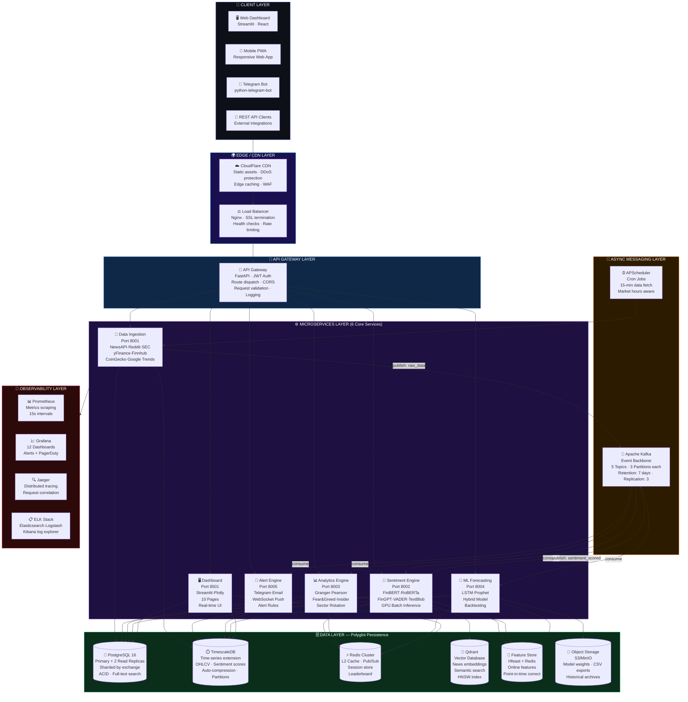

<br/>

---

## 📊 2. Data Flow — End to End

### 🔄 Complete Data Pipeline (Happy Path)

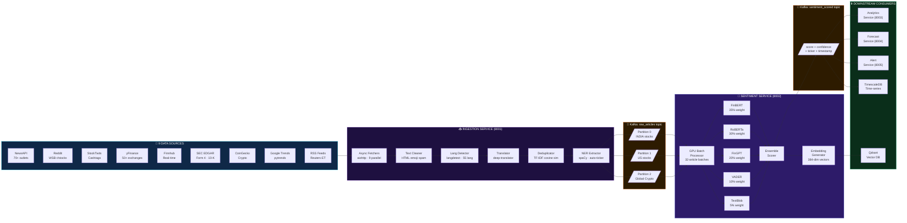

<br/>

### ⏱️ Latency Budget per Pipeline Stage

```
╔══════════════════════════════════════════════════════════════════════════╗
║                    END-TO-END LATENCY BUDGET                            ║
╠══════════════════════════════════════════════════════════════════════════╣
║  Stage                         │  Target P50  │  Target P99  │  Budget  ║
╠═══════════════════════════════════════════════════════════════════════════╣
║  API Source fetch (async)      │    800ms     │   2,000ms    │  2,000ms ║
║  Text cleaning & NER           │     50ms     │     200ms    │    200ms ║
║  Kafka publish                 │      5ms     │      20ms    │     20ms ║
║  GPU Batch inference (32 art.) │    200ms     │     500ms    │    500ms ║
║  Ensemble scoring              │     10ms     │      30ms    │     30ms ║
║  Qdrant vector upsert          │     20ms     │      80ms    │     80ms ║
║  TimescaleDB write             │     15ms     │      50ms    │     50ms ║
║  Redis cache update            │      2ms     │       5ms    │      5ms ║
║  Alert trigger (if applicable) │     30ms     │     100ms    │    100ms ║
╠═══════════════════════════════════════════════════════════════════════════╣
║  TOTAL (news → alert)          │  ~1,132ms    │  ~2,985ms    │  ~3s max ║
╚══════════════════════════════════════════════════════════════════════════╝
```

---

## 🗄️ 3. Database Design — Polyglot Persistence

> **Strategy:** Use the **right database for the right job**. No single database handles all use cases optimally.

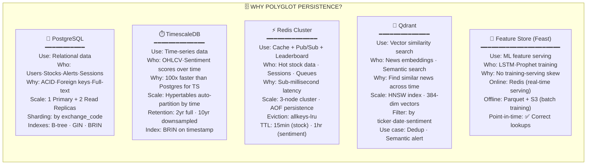

<br/>

### 📐 Core Database Schema

<details open>
<summary><b>🐘 PostgreSQL — Primary Schema (Key Tables)</b></summary>

```sql
-- ══════════════════════════════════════════════════
--  STOCKS UNIVERSE TABLE
-- ══════════════════════════════════════════════════
CREATE TABLE stocks (
    id              BIGSERIAL PRIMARY KEY,
    ticker          VARCHAR(20)  NOT NULL UNIQUE,    -- e.g. "RELIANCE.NS"
    name            VARCHAR(200) NOT NULL,            -- e.g. "Reliance Industries"
    exchange        VARCHAR(20)  NOT NULL,            -- e.g. "NSE", "NYSE"
    exchange_code   VARCHAR(10)  NOT NULL,            -- Shard key
    sector          VARCHAR(100),                     -- GICS sector
    country         CHAR(2)      NOT NULL,            -- ISO country code
    currency        CHAR(3)      NOT NULL,            -- ISO currency code
    market_cap_usd  BIGINT,
    is_active       BOOLEAN      DEFAULT TRUE,
    created_at      TIMESTAMPTZ  DEFAULT NOW(),
    updated_at      TIMESTAMPTZ  DEFAULT NOW()
);

CREATE INDEX idx_stocks_exchange ON stocks(exchange_code);
CREATE INDEX idx_stocks_country ON stocks(country);
CREATE INDEX idx_stocks_sector ON stocks(sector);

-- ══════════════════════════════════════════════════
--  NEWS ARTICLES TABLE
-- ══════════════════════════════════════════════════
CREATE TABLE articles (
    id              BIGSERIAL    PRIMARY KEY,
    external_id     VARCHAR(64)  UNIQUE,             -- Source dedup hash
    ticker          VARCHAR(20)  REFERENCES stocks(ticker),
    source          VARCHAR(50)  NOT NULL,           -- "newsapi", "reddit", etc.
    title           TEXT         NOT NULL,
    body            TEXT,
    url             VARCHAR(500),
    language_orig   CHAR(5),                         -- Original language
    language_norm   CHAR(5)      DEFAULT 'en',       -- Normalized to EN
    published_at    TIMESTAMPTZ  NOT NULL,
    fetched_at      TIMESTAMPTZ  DEFAULT NOW(),
    content_hash    CHAR(64)     UNIQUE              -- SHA256 for dedup
);

CREATE INDEX idx_articles_ticker_time ON articles(ticker, published_at DESC);
CREATE INDEX idx_articles_published ON articles(published_at DESC);
CREATE INDEX idx_articles_source ON articles(source);
-- Full-text search index
CREATE INDEX idx_articles_fts ON articles USING GIN(to_tsvector('english', title || ' ' || COALESCE(body,'')));

-- ══════════════════════════════════════════════════
--  SENTIMENT SCORES TABLE
-- ══════════════════════════════════════════════════
CREATE TABLE sentiment_scores (
    id              BIGSERIAL    PRIMARY KEY,
    article_id      BIGINT       REFERENCES articles(id),
    ticker          VARCHAR(20)  REFERENCES stocks(ticker),
    scored_at       TIMESTAMPTZ  DEFAULT NOW(),
    -- Individual model scores
    finbert_score   DECIMAL(5,4),
    finbert_label   VARCHAR(10),
    roberta_score   DECIMAL(5,4),
    roberta_label   VARCHAR(10),
    fingpt_score    DECIMAL(5,4),
    fingpt_label    VARCHAR(10),
    vader_score     DECIMAL(5,4),
    textblob_score  DECIMAL(5,4),
    textblob_subj   DECIMAL(5,4),    -- Subjectivity 0-1
    -- Ensemble output
    ensemble_score  DECIMAL(5,4) NOT NULL,           -- -1.0 to +1.0
    ensemble_label  VARCHAR(15)  NOT NULL,           -- STRONG_BULLISH etc
    confidence      DECIMAL(5,4) NOT NULL,           -- 0.0 to 1.0
    model_agreement BOOLEAN      NOT NULL,           -- All models agree?
    processing_ms   INTEGER                          -- Inference latency
);

CREATE INDEX idx_sentiment_ticker_time ON sentiment_scores(ticker, scored_at DESC);
CREATE INDEX idx_sentiment_ensemble ON sentiment_scores(ensemble_score);

-- ══════════════════════════════════════════════════
--  USER WATCHLIST TABLE
-- ══════════════════════════════════════════════════
CREATE TABLE watchlists (
    id              BIGSERIAL    PRIMARY KEY,
    user_id         BIGINT       NOT NULL,
    ticker          VARCHAR(20)  REFERENCES stocks(ticker),
    added_at        TIMESTAMPTZ  DEFAULT NOW(),
    alert_bullish   DECIMAL(3,2) DEFAULT 0.75,       -- Custom threshold
    alert_bearish   DECIMAL(3,2) DEFAULT -0.60,
    UNIQUE(user_id, ticker)
);

-- ══════════════════════════════════════════════════
--  SIGNALS TABLE (Audit trail via Event Sourcing)
-- ══════════════════════════════════════════════════
CREATE TABLE signal_events (
    id              BIGSERIAL    PRIMARY KEY,
    event_id        UUID         DEFAULT gen_random_uuid() UNIQUE,
    event_type      VARCHAR(50)  NOT NULL,           -- "SIGNAL_GENERATED"
    ticker          VARCHAR(20)  REFERENCES stocks(ticker),
    event_payload   JSONB        NOT NULL,           -- Full event data
    ensemble_score  DECIMAL(5,4),
    signal_label    VARCHAR(20),
    created_at      TIMESTAMPTZ  DEFAULT NOW()
);

-- Event sourcing — never UPDATE or DELETE, only INSERT
-- JSONB index for payload queries
CREATE INDEX idx_signals_payload ON signal_events USING GIN(event_payload);
```

</details>

<details>
<summary><b>⏱️ TimescaleDB — Time-Series Hypertables</b></summary>

```sql
-- ══════════════════════════════════════════════════
--  OHLCV PRICE DATA (Hypertable — auto-partitioned by time)
-- ══════════════════════════════════════════════════
CREATE TABLE ohlcv (
    time        TIMESTAMPTZ NOT NULL,
    ticker      VARCHAR(20) NOT NULL,
    open        DECIMAL(12,4),
    high        DECIMAL(12,4),
    low         DECIMAL(12,4),
    close       DECIMAL(12,4),
    volume      BIGINT,
    adj_close   DECIMAL(12,4),
    currency    CHAR(3)
);

-- Convert to hypertable (partitioned by 1 week chunks)
SELECT create_hypertable('ohlcv', 'time', chunk_time_interval => INTERVAL '1 week');

-- Compression for data older than 30 days (saves ~90% space)
ALTER TABLE ohlcv SET (timescaledb.compress, timescaledb.compress_orderby = 'time DESC');
SELECT add_compression_policy('ohlcv', INTERVAL '30 days');

-- Data retention: keep 2 years full, downsample beyond
SELECT add_retention_policy('ohlcv', INTERVAL '2 years');

-- Continuous aggregate: 1-hour OHLCV rolled up automatically
CREATE MATERIALIZED VIEW ohlcv_hourly
WITH (timescaledb.continuous) AS
SELECT  time_bucket('1 hour', time) AS bucket,
        ticker,
        first(open, time)           AS open,
        max(high)                   AS high,
        min(low)                    AS low,
        last(close, time)           AS close,
        sum(volume)                 AS volume
FROM ohlcv GROUP BY bucket, ticker;

-- ══════════════════════════════════════════════════
--  ROLLING SENTIMENT AGGREGATES (Continuous Aggregate)
-- ══════════════════════════════════════════════════
CREATE MATERIALIZED VIEW sentiment_hourly
WITH (timescaledb.continuous) AS
SELECT  time_bucket('1 hour', scored_at)  AS bucket,
        ticker,
        avg(ensemble_score)               AS avg_score,
        count(*)                          AS article_count,
        stddev(ensemble_score)            AS score_stddev
FROM sentiment_scores GROUP BY bucket, ticker;
```

</details>

<details>
<summary><b>🔮 Qdrant — Vector Schema (News Embeddings)</b></summary>

```python
# Qdrant Collection Configuration
# 384-dim embeddings from sentence-transformers/all-MiniLM-L6-v2

from qdrant_client import QdrantClient
from qdrant_client.models import Distance, VectorParams, HnswConfigDiff, PayloadSchemaType

client = QdrantClient(host="qdrant", port=6333)

# Create collection with HNSW index
client.create_collection(
    collection_name="news_embeddings",
    vectors_config=VectorParams(
        size=384,                    # all-MiniLM-L6-v2 output dim
        distance=Distance.COSINE     # Cosine similarity for text
    ),
    hnsw_config=HnswConfigDiff(
        m=16,                        # Connections per node (higher = more accurate)
        ef_construct=200,            # Build-time accuracy
        full_scan_threshold=10_000   # Use HNSW above this count
    ),
    # Payload indexes for filtered search
    optimizers_config={"default_segment_number": 4}
)

# Index payload fields for fast filtering
client.create_payload_index("news_embeddings", "ticker", PayloadSchemaType.KEYWORD)
client.create_payload_index("news_embeddings", "published_at", PayloadSchemaType.DATETIME)
client.create_payload_index("news_embeddings", "ensemble_score", PayloadSchemaType.FLOAT)
client.create_payload_index("news_embeddings", "source", PayloadSchemaType.KEYWORD)

# Example vector point payload:
# {
#   "id": "uuid4",
#   "vector": [0.023, -0.441, ..., 0.187],   # 384 floats
#   "payload": {
#     "article_id": 12345,
#     "ticker": "RELIANCE.NS",
#     "title": "Reliance beats Q3 earnings",
#     "source": "newsapi",
#     "published_at": "2025-01-15T09:30:00Z",
#     "ensemble_score": 0.87,
#     "ensemble_label": "STRONG_BULLISH"
#   }
# }
```

</details>

---

## 🧠 4. AI/ML Pipeline — Feature Store + Vector DB

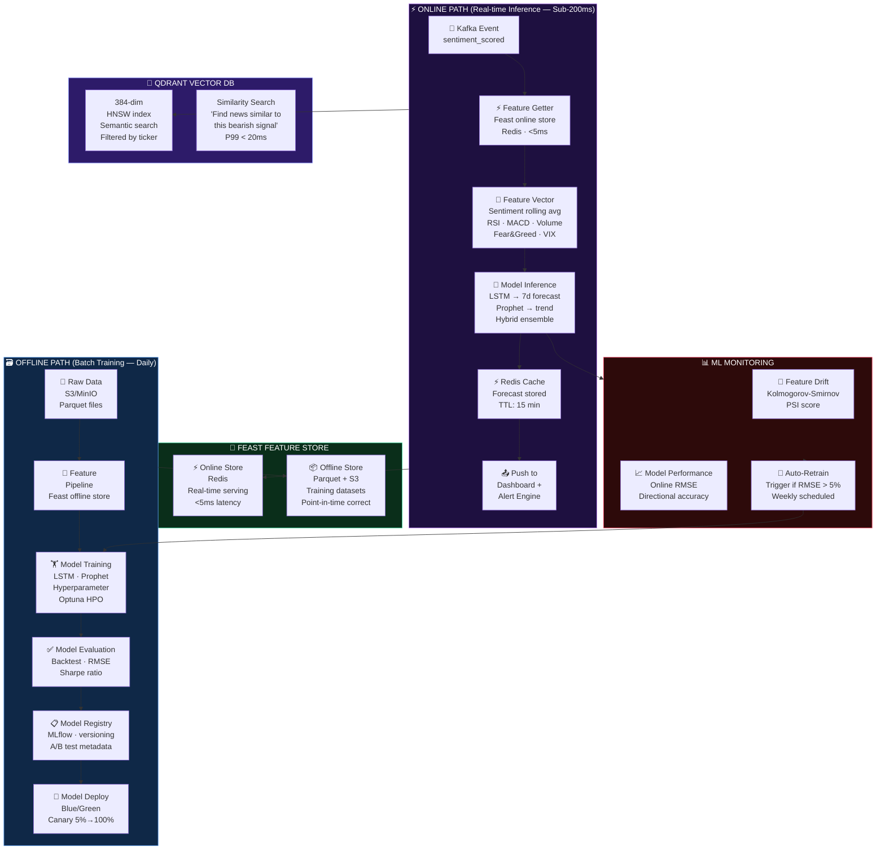

<br/>

### 🎯 Feature Engineering — 47 ML Features

| Category | Features | Count |
|:--|:--|:--:|
| **Sentiment Features** | Rolling 1h/4h/1d/7d avg score · Score momentum · Model agreement flag · Confidence stddev | 8 |
| **Price/Volume Features** | RSI(14) · MACD(12,26,9) · SMA(7,20,50) · Bollinger Band width · Volume surge ratio · ATR | 12 |
| **Market Context Features** | VIX proxy · S&P 500 correlation · Sector relative strength · Put/call ratio proxy | 6 |
| **Social Signal Features** | Reddit mention velocity · StockTwits bull/bear ratio · Google Trends z-score | 5 |
| **Fundamental Features** | P/E ratio · Market cap tier · Revenue growth · Insider buy/sell ratio | 6 |
| **Temporal Features** | Day of week · Hour · Days until earnings · Days from last dividend | 5 |
| **Statistical Features** | Granger p-value(lag1) · Pearson r(30d) · Sentiment autocorrelation · Entropy | 5 |
| **TOTAL** | | **47** |

---

## ⚡ 5. Real-Time Layer — Apache Kafka + WebSocket

### 📨 Kafka Topic Design

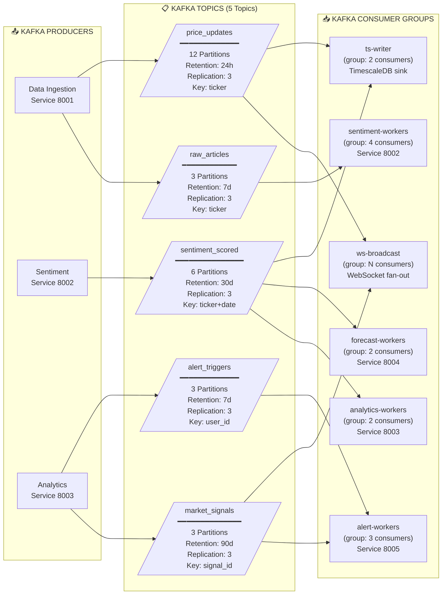

<br/>

### 🔌 WebSocket — Fan-Out Architecture

```
USER DEVICE  ←── WebSocket ──→  WS Server Node 1  ─┐
USER DEVICE  ←── WebSocket ──→  WS Server Node 2  ──┤←── Redis Pub/Sub ←── Kafka Consumer
USER DEVICE  ←── WebSocket ──→  WS Server Node 3  ──┤
USER DEVICE  ←── WebSocket ──→  WS Server Node 4  ─┘

Max connections per node:  ~10,000 (configurable)
Total WebSocket capacity:  10,000 × N nodes (horizontally scaled)
Message fanout latency:    < 50ms (Redis Pub/Sub to client)
Protocol:                  WSS (TLS 1.3) + Binary MessagePack frames
Heartbeat interval:        30 seconds (detect stale connections)
Reconnect strategy:        Exponential backoff + jitter (1s → 30s max)
```

---

## 🔀 6. CQRS + Event Sourcing Pattern

> **Why CQRS?** The **Command side** (write: new sentiment score) has different performance requirements from the **Query side** (read: dashboard rendering). CQRS separates them for optimal performance at each.

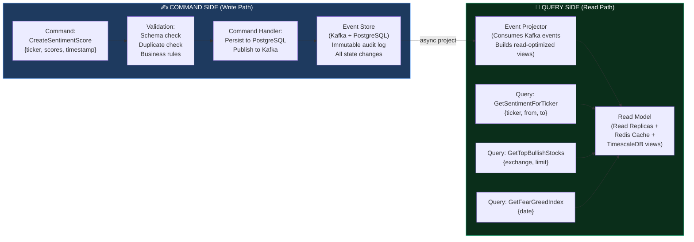

<br/>

**📋 Event Sourcing — Immutable Event Log Sample:**
```json
[
  { "event_id": "uuid1", "type": "ARTICLE_FETCHED",    "ticker": "TCS.NS", "source": "newsapi", "timestamp": "2025-08-21T09:00:00Z" },
  { "event_id": "uuid2", "type": "SENTIMENT_SCORED",   "ticker": "TCS.NS", "ensemble": 0.82, "label": "STRONG_BULLISH", "timestamp": "2025-08-21T09:00:01Z" },
  { "event_id": "uuid3", "type": "SIGNAL_GENERATED",   "ticker": "TCS.NS", "signal": "BUY", "confidence": 0.91, "timestamp": "2025-08-21T09:00:02Z" },
  { "event_id": "uuid4", "type": "ALERT_TRIGGERED",    "ticker": "TCS.NS", "user_id": 42, "channel": "telegram", "timestamp": "2025-08-21T09:00:03Z" },
  { "event_id": "uuid5", "type": "FORECAST_UPDATED",   "ticker": "TCS.NS", "7d_forecast": [3450, 3480, 3510], "timestamp": "2025-08-21T09:01:00Z" }
]
```
> Every state change is an **immutable event**. System can be **replayed from zero** to reconstruct any past state. Perfect for auditing, debugging, and regulatory compliance.

---

## 🛡️ 7. Caching Architecture — 4-Layer Strategy

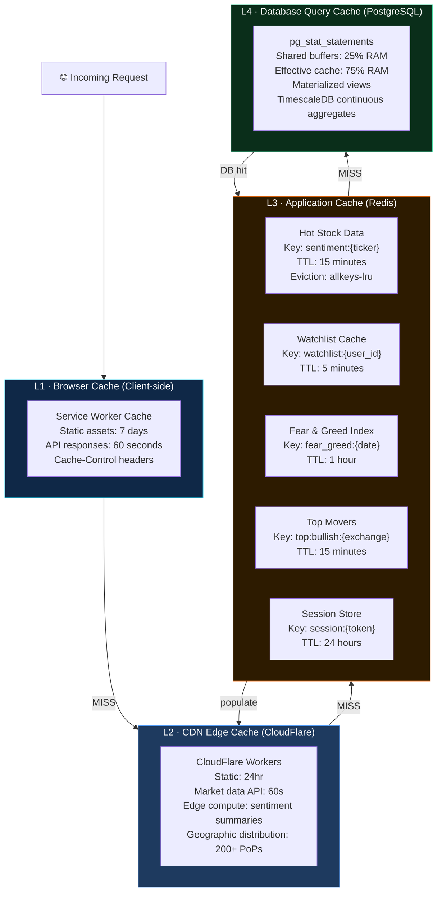

<br/>

**📊 Cache Hit Rate Targets:**
| Layer | Target Hit Rate | Fallback |
|:--|:--:|:--|
| L1 Browser | 60% | → L2 CDN |
| L2 CDN Edge | 75% | → L3 Redis |
| L3 Redis | 92% | → L4 PostgreSQL |
| L4 PostgreSQL | 98% | → Disk I/O |
| **Effective DB load reduction** | **~99.5%** | — |

---

## 🌍 8. Global CDN + Edge Architecture

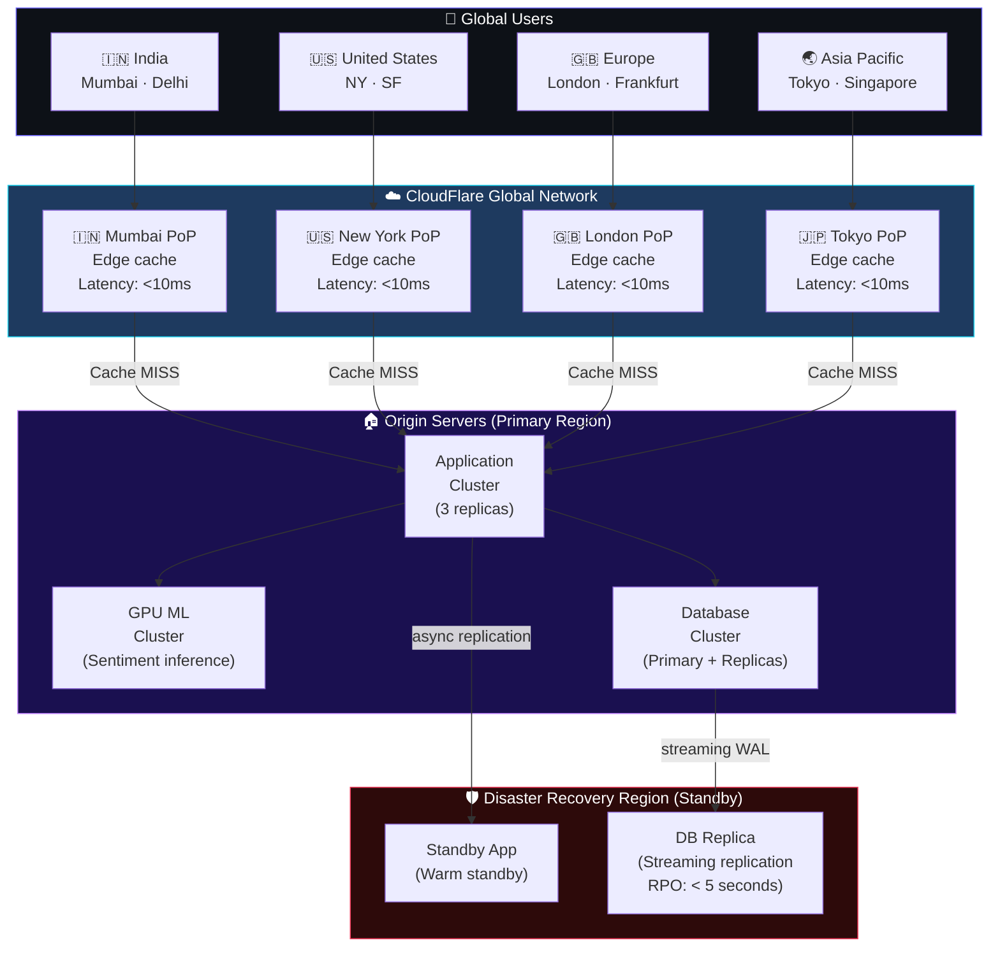

---

## 🔐 9. Security Architecture — Zero Trust

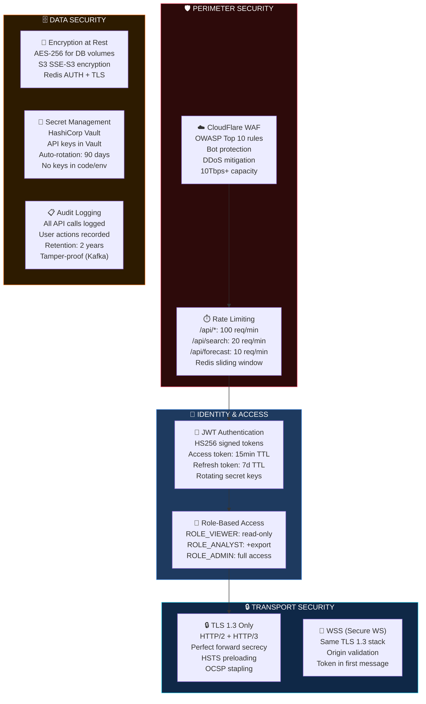

---

## 📈 10. Scalability — Auto-Scaling Design

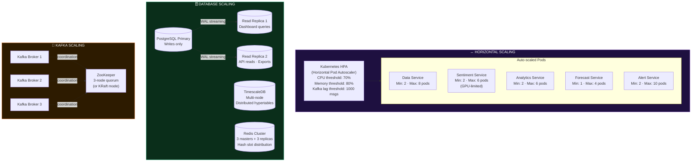

<br/>

### 📊 Expected Capacity at Scale

| Metric | Phase 1 (MVP) | Phase 2 (Growth) | Phase 3 (Scale) |
|:--|:--:|:--:|:--:|
| Concurrent Users | 100 | 10,000 | 500,000 |
| Articles/day | 50K | 500K | 5M |
| Sentiment scores/day | 50K | 500K | 5M |
| API req/day | 500K | 10M | 500M |
| DB storage/month | 10 GB | 200 GB | 5 TB |
| Kafka throughput | 100 msg/s | 2K msg/s | 50K msg/s |
| Redis memory | 512 MB | 8 GB | 64 GB |

---

## 🔭 11. Observability — Full-Stack Monitoring

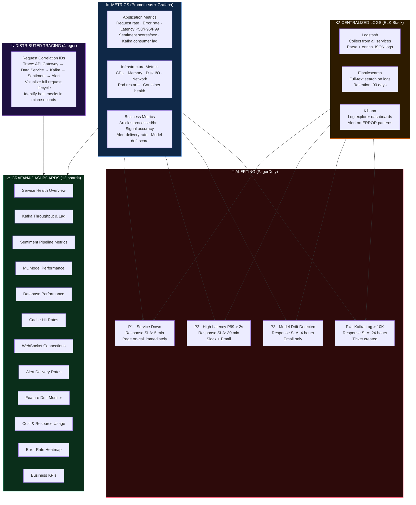

---

## 🛠️ 12. CI/CD Pipeline — GitOps

```mermaid
graph LR
    subgraph DEV["👨‍💻 DEVELOPER"]
        GIT["git push\nfeature/xyz"]
    end

    subgraph PR["🔍 PULL REQUEST CHECKS"]
        LINT["Ruff · Black\nCode style"]
        TEST["pytest\nUnit + Integration\nMin coverage: 80%"]
        SEC["Bandit\nSecurity scan\nSnyk dependencies"]
        BUILD["Docker build\nImage scan\nTrivy vulnerabilities"]
    end

    subgraph STAGING["🧪 STAGING ENVIRONMENT"]
        STAGE_DEPLOY["kubectl apply\nStaging namespace"]
        INT_TEST["Integration tests\nAPI contract tests\nPerf benchmarks"]
        CANARY["Canary 10%\ntraffic → new version\nMonitor 30 min"]
    end

    subgraph PROD["🚀 PRODUCTION"]
        BLUE_GREEN["Blue/Green Deploy\nInstant rollback\nif error rate > 1%"]
        SMOKE["Smoke Tests\nHealth check all\n6 services"]
        MONITOR["Monitor 1hr\nP99 latency\nError rate\nKafka lag"]
    end

    GIT --> LINT --> TEST --> SEC --> BUILD
    BUILD -->|"merge to main"| STAGE_DEPLOY
    STAGE_DEPLOY --> INT_TEST --> CANARY
    CANARY -->|"✅ pass"| BLUE_GREEN
    BLUE_GREEN --> SMOKE --> MONITOR

    MONITOR -->|"❌ regression"| BLUE_GREEN
    BLUE_GREEN -->|"rollback"| BLUE_GREEN

    style DEV fill:#0d1117,stroke:#6C63FF,color:#fff
    style PR fill:#0f2847,stroke:#22d3ee,color:#fff
    style STAGING fill:#2d1b00,stroke:#f97316,color:#fff
    style PROD fill:#0a2e1a,stroke:#34d399,color:#fff
```

---

## 🔄 13. Disaster Recovery — RTO/RPO

| Scenario | RPO (Data Loss Max) | RTO (Recovery Time) | Strategy |
|:--|:--:|:--:|:--|
| Single pod crash | 0 | < 30 sec | Kubernetes restarts automatically |
| Single DB node failure | 0 | < 1 min | PostgreSQL streaming replication failover |
| Full primary region outage | < 5 sec | < 15 min | Warm standby DR region auto-failover |
| Kafka broker failure | 0 | < 2 min | Partition leader re-election (replication factor 3) |
| Redis cache loss | N/A (cache) | < 1 min | Rebuild from TimescaleDB/PostgreSQL |
| Catastrophic data loss | < 24 hr | < 4 hr | S3 daily snapshots restore + event replay |

### 🗂️ Backup Strategy

```
┌──────────────────────────────────────────────────────────┐
│                   BACKUP SCHEDULE                        │
├──────────────┬───────────────┬──────────────────────────┤
│  Frequency   │  Target       │  Retention               │
├──────────────┼───────────────┼──────────────────────────┤
│  Continuous  │  WAL archive  │  7 days (point-in-time)  │
│  Hourly      │  Redis RDB    │  24 hours                │
│  Daily       │  Full PG dump │  30 days                 │
│  Daily       │  TS data      │  90 days                 │
│  Weekly      │  Full S3 snap │  1 year                  │
│  Monthly     │  Cold archive │  7 years (compliance)    │
└──────────────┴───────────────┴──────────────────────────┘
```

---

## 📐 14. API Design — REST + gRPC + WebSocket

### 🌐 REST API Endpoints

```
BASE URL: https://api.indra-marketmind.io/v1

── STOCKS ────────────────────────────────────────────────
GET    /stocks                          List all stocks (paginated)
GET    /stocks/{ticker}                 Stock details + current sentiment
GET    /stocks/{ticker}/sentiment       Sentiment timeline
GET    /stocks/{ticker}/forecast        7d + 30d AI forecast
GET    /stocks/{ticker}/news            Latest news with NLP tags
GET    /stocks/{ticker}/insider         SEC insider trades
GET    /stocks/search?q={query}         Search by name or ticker

── MARKET ────────────────────────────────────────────────
GET    /market/fear-greed               Global Fear & Greed Index
GET    /market/top-bullish              Top bullish stocks (exchange filter)
GET    /market/top-bearish              Top bearish stocks (exchange filter)
GET    /market/sector-heatmap           All 11 GICS sectors sentiment
GET    /market/global-map               Country-level sentiment map data

── ANALYTICS ─────────────────────────────────────────────
GET    /analytics/correlation/{ticker}  Granger + Pearson results
GET    /analytics/rolling/{ticker}      Rolling correlation 7d/30d

── ALERTS ────────────────────────────────────────────────
GET    /alerts                          User's alert history
POST   /alerts/rules                    Create alert rule
PUT    /alerts/rules/{id}               Update rule
DELETE /alerts/rules/{id}               Delete rule

── USER ──────────────────────────────────────────────────
GET    /user/watchlist                  User's watchlist
POST   /user/watchlist/{ticker}         Add to watchlist
DELETE /user/watchlist/{ticker}         Remove from watchlist

── AUTH ──────────────────────────────────────────────────
POST   /auth/login                      Get JWT tokens
POST   /auth/refresh                    Refresh access token
POST   /auth/logout                     Invalidate tokens
```

### 🔌 WebSocket Protocol

```
ENDPOINT: wss://ws.indra-marketmind.io/v1/stream

── SUBSCRIBE MESSAGES ────────────────────────────────────
{ "action": "subscribe",   "tickers": ["RELIANCE.NS", "TCS.NS"] }
{ "action": "unsubscribe", "tickers": ["TCS.NS"] }
{ "action": "subscribe",   "channel": "fear_greed" }
{ "action": "subscribe",   "channel": "top_movers" }

── SERVER PUSH MESSAGES ──────────────────────────────────
{
  "type":       "sentiment_update",
  "ticker":     "RELIANCE.NS",
  "score":       0.82,
  "label":      "STRONG_BULLISH",
  "confidence":  0.91,
  "timestamp":  "2025-08-21T09:15:00Z",
  "trigger":    "Q3 earnings beat news"
}
{
  "type":    "price_update",
  "ticker":  "RELIANCE.NS",
  "price":    2847.50,
  "change":   1.23,
  "volume":   4523100
}
{
  "type":  "alert_triggered",
  "ticker": "TCS.NS",
  "signal": "STRONG_BEARISH",
  "message": "Sentiment dropped to -0.74"
}
```

---

## 📊 15. Capacity Planning & SLAs

### 🎯 Service Level Objectives (SLOs)

```
╔══════════════════════════════════════════════════════════════════════╗
║                    INDRA-MARKETMIND — SLA TARGETS                   ║
╠══════════════════════════════════════════════════════════════════════╣
║  Metric                          │  Target         │  Alert At      ║
╠══════════════════════════════════════════════════════════════════════╣
║  Uptime (Availability)           │  99.9% / month  │  < 99.5%       ║
║  API Latency P50                 │  < 80ms         │  > 150ms       ║
║  API Latency P99                 │  < 200ms        │  > 500ms       ║
║  WebSocket message delivery      │  < 50ms         │  > 200ms       ║
║  News → Sentiment lag            │  < 3 min        │  > 10 min      ║
║  Dashboard refresh rate          │  15 minutes     │  > 30 min      ║
║  Telegram alert delivery         │  < 30 seconds   │  > 2 min       ║
║  ML Forecast P99 latency         │  < 500ms        │  > 2s          ║
║  Search query latency            │  < 100ms        │  > 300ms       ║
║  Error rate (all APIs)           │  < 0.1%         │  > 0.5%        ║
╚══════════════════════════════════════════════════════════════════════╝
```

### 💰 Infrastructure Cost Estimate (Monthly — AWS/GCP)

| Service | Config | Est. Cost/month |
|:--|:--|--:|
| App servers (6 services × 3 replicas) | `c6i.xlarge` × 18 | ~$1,200 |
| GPU instance (Sentiment service) | `g4dn.xlarge` × 2 | ~$450 |
| PostgreSQL RDS | `db.r6g.large` + 2 replicas | ~$350 |
| TimescaleDB | `db.r6g.large` | ~$200 |
| Redis ElastiCache | `cache.r6g.large` cluster | ~$280 |
| Kafka (MSK) | 3 brokers `kafka.m5.large` | ~$400 |
| Qdrant (self-hosted) | `c6i.large` | ~$80 |
| Object Storage (S3) | 500 GB + transfer | ~$30 |
| CloudFlare CDN | Pro plan | ~$25 |
| Monitoring (Grafana Cloud) | Pro plan | ~$50 |
| **TOTAL** | | **~$3,065/month** |

> 💡 **Self-hosted alternative:** Run everything on a single `c6i.4xlarge` server (~$400/mo) for MVP phase using Docker Compose. Scale to K8s when traffic justifies it.

---

<div align="center">

---

```
╔══════════════════════════════════════════════════════════════════════════╗
║                                                                          ║
║   This system design borrows the best from:                             ║
║   Bloomberg (Ticker Plant) + Robinhood (Event-driven) +                 ║
║   Coinbase (Polyglot Persistence) + Zerodha (India-first) +             ║
║   then adds an AI-first ML layer that none of them have.               ║
║                                                                          ║
║               — Designed by Indrajit Kumar                              ║
║                                                                          ║
╚══════════════════════════════════════════════════════════════════════════╝
```

**[← Back to Main Plan](Indra-MarketMind-Plan.md)** | **[View on GitHub](https://github.com/indrajitkumar23541-a11y/Indra-MarketMind)**

</div>
